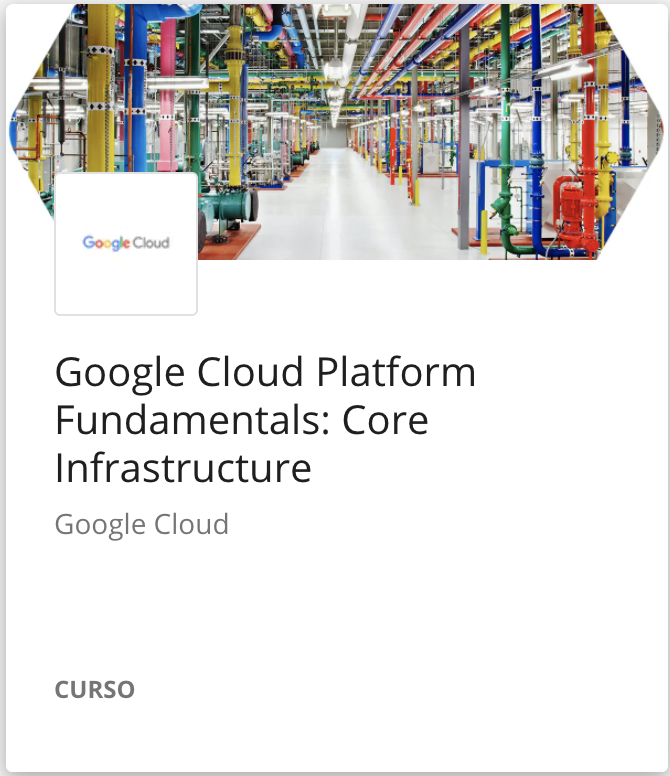
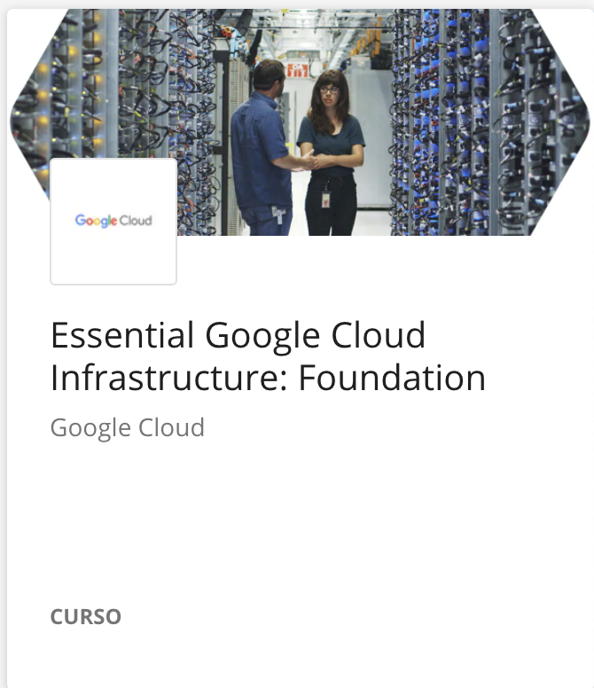

////
NO CAMBIAR!!
Codificación, idioma, tabla de contenidos, tipo de documento
////
:encoding: utf-8
:lang: es
:toc: right
:toc-title: Tabla de contenidos
:doctype: book
:linkattrs:

////
Nombre y título del trabajo
////
# Planificación recomendada para seguir el Programa Especializado: Architecting with Google Compute Engine
Cloud Computing - Máster en Tecnologías y Aplicaciones en Ingeniería Informática
José Joaquín Cañadas y Manuel Torres <jjcanada@ual.es> <mtorres@ual.es>

image::Tema1/images/di.png[]

// NO CAMBIAR!! (Entrar en modo no numerado de apartados)
:numbered!: 

[abstract]
== Resumen
////
COLOCA A CONTINUACION EL RESUMEN
////

Planificación recomendada para seguir el programa especializado _Architecting with Google Compute Engine_ durante el desarrollo de la asignatura de Cloud Computing.

////
COLOCA A CONTINUACION LOS OBJETIVOS
////
.Objetivos
* Ofrecer una planificación ordenada para poder desarrollar de forma equilibrada los cursos del programa especializado _Architecting with Google Compute Engine_

// Entrar en modo numerado de apartados
:numbered:

## Planificación recomendada

:numbered!: 

### Semana 1

* Introducing Google Cloud Platform
* Getting Started with Google Cloud Platform
* Virtual Machines in the Cloud

### Semana 2

 

* Introduction
* Module 1: Introduction to GCP
* Module 2: Virtual Networks |

### Semana 3

 

* Module 3: Virtual Machines

image::Tema1/images/EssentialGoogleCloudInfrastructureCoreServices.png[width=33%]

* Introduction
* Module 1: Cloud IAM

### Semana 4

* Storage in the Cloud

image::Tema1/images/EssentialGoogleCloudInfrastructureCoreServices.png[width=33%]

* Module 2: Storage and Database Services
* Module 3: Resource Management
* Module 4: Resource Monitoring

### Semana 5

image::Tema1/images/ElasticGoogleCloudInfrastructureScalingAndAutomation.png[width=33%]

* Introduction
* Module 1: Interconnecting Networks
* Module 2: Load Balancing and Autoscaling
* Module 3: Infrastructure Automation
* Module 4: Managed Services

### Semana 6

* Containers in the Cloud
* Applications in the Cloud
* Developing, Deploying and Monitoring in the Cloud
* Big Data and Machine Learning in the Cloud
* Summary and Review

### Semana 7

image::Tema1/images/ReliableGoogleCloudInfrastructureDesignAndProcess.png[width=33%]

* Introduction
* Defining Services
* Microservice Design and Architecture
* DevOps Automation
* Choosing Storage Solutions
* Google Cloud and Hybrid Network Architecture
* Deploying Applications to Google Cloud
* Designing Reliable Systems
* Security
* Maintenance and Monitoring

### Semana 8

* Entrega final de actividades. Para evitar acumulación de trabajo en la fecha de vencimiento se recomienda ir entregando cada actividad en su semana y así resolver las dudas planteadas en las clases presenciales.