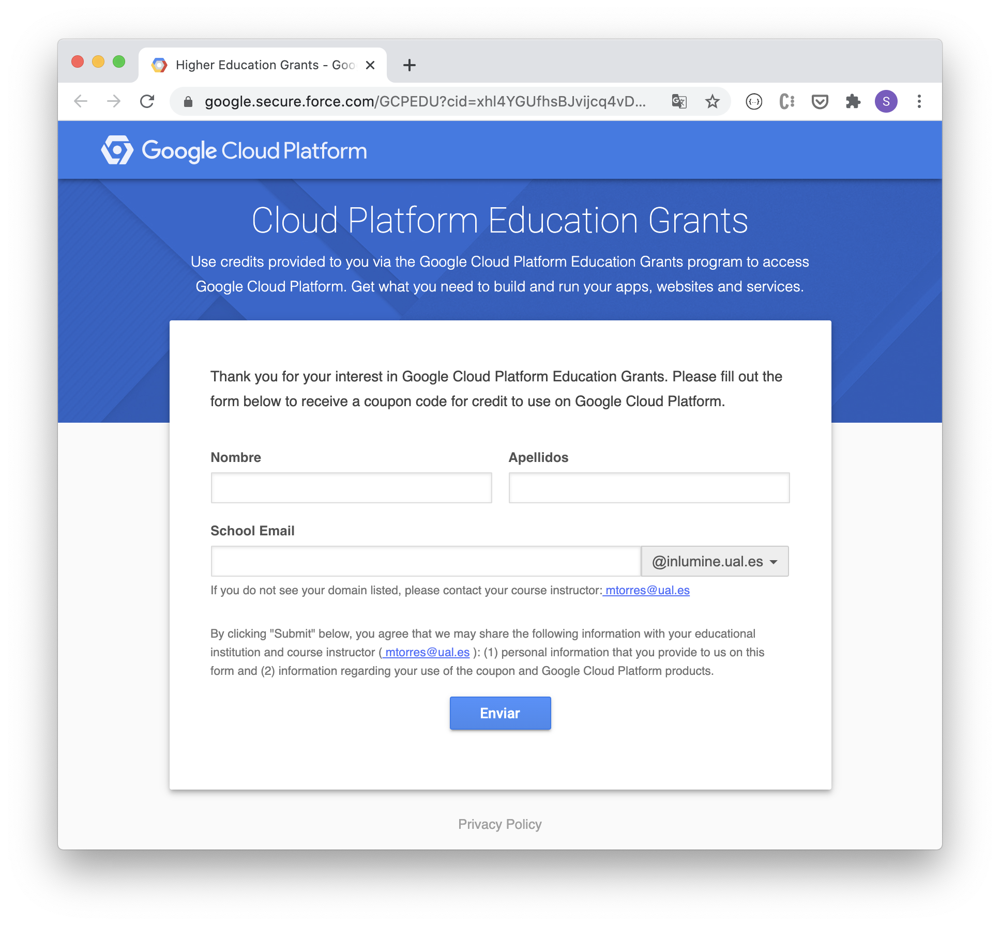

////
NO CAMBIAR!!
Codificación, idioma, tabla de contenidos, tipo de documento
////
:encoding: utf-8
:lang: es
:toc: right
:toc-title: Tabla de contenidos
:doctype: book
:linkattrs:

////
Nombre y título del trabajo
////
# Activación de cuenta Google Cloud Platform
Cloud Computing - Máster en Tecnologías y Aplicaciones en Ingeniería Informática
José Joaquín Cañadas y Manuel Torres <jjcanada@ual.es> <mtorres@ual.es>

image::images/di.png[]

// NO CAMBIAR!! (Entrar en modo no numerado de apartados)
:numbered!: 

[abstract]
== Resumen
////
COLOCA A CONTINUACION EL RESUMEN
////
En este tutorial se indica cómo activar el cupón académico en Google Cloud  para el desarrollo de la asignatura. Tras la activación y registro en Google Cloud se podrá consultar el crédito disponible para usar libremente en servicios de Google Cloud.

////
COLOCA A CONTINUACION LOS OBJETIVOS
////
.Objetivos
* Activación del cupón de 50$ en Google Cloud para el desarrollo de la asignatura.
* Registro en Google Cloud.

// Entrar en modo numerado de apartados
:numbered:

## Introducción

Google Cloud ofrece un programa de formación para centros académicos. Para el desarrollo de la formación ofrece el acceso a un cupón de 50$ de un año de duración. A continuación se describen los pasos que se deben seguir los estudiantes de la asignatura para la activación del cupón.

## Pasos

Para realizar la activación del cupón académico personal de 50$ para la asignatura se debe usar la cuenta de email de Inlumine UAL (`xxxxxx@inlumine.ual.es`). *Sólo tendrás acceso al cupón de 50$ con la cuenta de la UAL*. 

[NOTE]
====
Si no dispones todavía de cuenta personal de correo en la UAL `xxxxxx@inlumine.ual.es`, puedes creártela entrando en https://campus.ual.es/[Campus Virtual], y seleccionando `Solicitud Alta en Campus`. 

image::images/SolicitudAltaEnCampus.png[]
====

En Aula Virtual tienes el enlace al `Student Coupon Retrieval Link` para activar tu cupón de 50$ en Google Cloud para la asignatura. Accederás a un formulario como el siguiente para introducir nombre, apellidos y email de la UAL.

Tras rellenar el formulario, recibirás un email en tu cuenta `@inlumine.ual.es`. En el mail tendrás el enlace para activar el cupón con el texto `Click [here] to redeem`. El enlace ya incorpora el código del cupón facilitado en el email.

[IMPORTANT]
====
Antes de hacer click en el enlace de activación del cupón recibido en el email asegúrate de no tener iniciada una sesión con tu cuenta de personal de Gmail. 
====

Tras finalizar la activación, accede a la Consola de Google desde https://console.cloud.google.com iniciando sesión con la cuenta `@inlumine.ual.es`. Para consultar tu crédito promocional, en el Menú de navegación de la izquierda selecciona `Facturación > Visión General`. Aparecerá disponible tu cuenta de facturación con el nombre de la asignatura y el crédito de tu cupón. 

image::images/GoogleCloudPlatformFacturacion.png[]

[NOTE]
====
Si tienes algún problema y no has recibido el email de invitación, o no puedes aceptar la invitación, entrar en GCP, etc, contacta por Aula virtual con tus profesores de la asignatura antes de la sesión presencial.
====

.Activación de prueba gratuita
****
Al entrar por primera vez en la Consola de Google Cloud aparecerá un banner informando de la activación de una Prueba gratuita con un cupón de 300$. 

[WARNING]
====
Para la activación de esta prueba de 300$ es necesaria una tarjeta de crédito y *no es necesaria para la asignatura*. La asignatura se desarrollará con el cupón académico de 50$ obtenido con la cuenta Inlumine de la UAL a través del enlace disponible en Aula Virtual.
====
****

