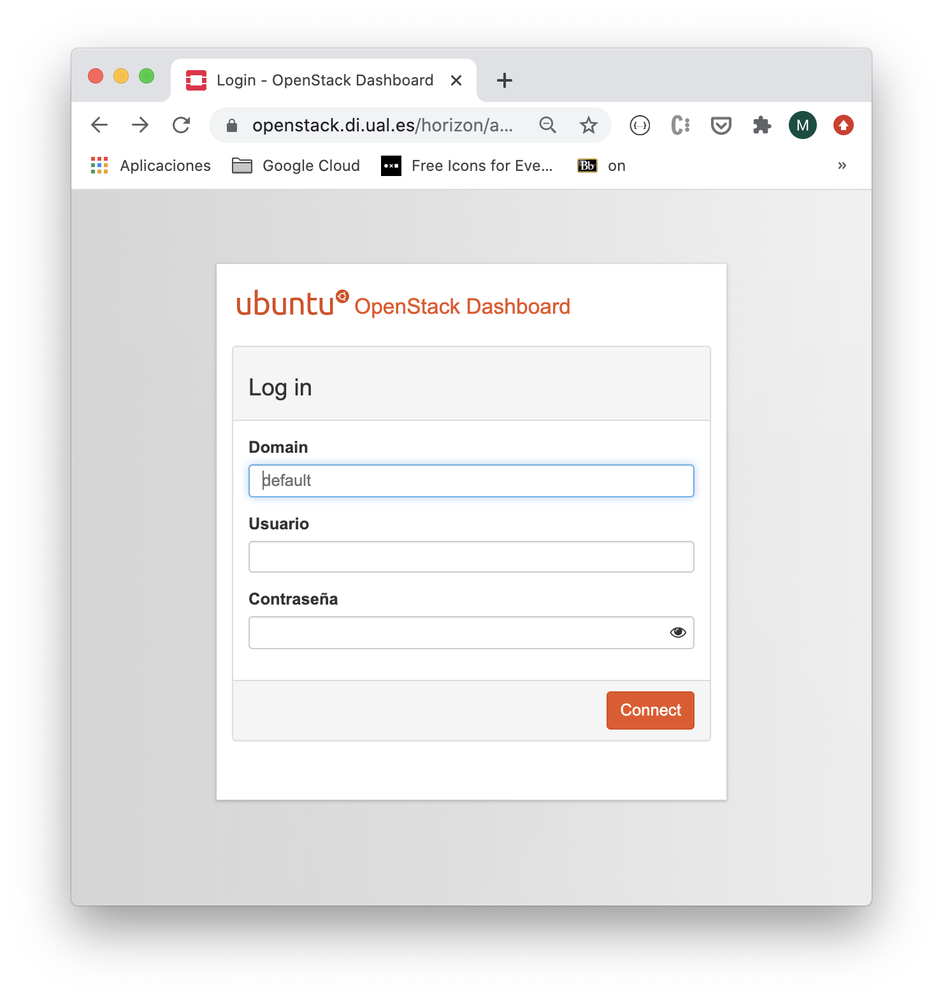

////
NO CAMBIAR!!
Codificación, idioma, tabla de contenidos, tipo de documento
////
:encoding: utf-8
:lang: es
:toc: right
:toc-title: Tabla de contenidos
:doctype: book
:linkattrs:

////
Nombre y título del trabajo
////
# Activación de cuenta OpenStack-DI
Cloud Computing - Máster en Ingeniería Informática
José Joaquín Cañadas y Manuel Torres <jjcanada@ual.es> <mtorres@ual.es>

image::images/di.png[]

// NO CAMBIAR!! (Entrar en modo no numerado de apartados)
:numbered!: 

[abstract]
== Resumen
////
COLOCA A CONTINUACION EL RESUMEN
////
En este tutorial se indica cómo acceder a la cuenta de OpenStack-DI, el cloud privado del Departamento de Informática de la UAL. Se indica cómo cambiar la contraseña, el acceso a tutoriales sobre la introducción a su uso y el acceso VPN.

////
COLOCA A CONTINUACION LOS OBJETIVOS
////
.Objetivos
* Acceder a OpenStack-DI.
* Cambiar la contraseña en OpenStack-DI.
* Conocer los recursos de consulta y formación de OpenStack-DI.

// Entrar en modo numerado de apartados
:numbered:

## Acceso a OpenStack-DI

https://openstack.di.ual.es/horizon/[OpenStack-DI] es la plataforma que ofrece Infraestructura como servicio en el cloud privado del Departamento de Informática de la UAL.

[NOTE]
====
*El acceso a todos los recursos de OpenStack-DI está limitado a la red de la UAL. Por tanto, el acceso desde fuera de la UAL se tendrá que realizar mediante VPN.*

* El ATIC de la UAL ofrece un https://vpn.ual.es[servicio de configuración de VPN].
* El ámbito de los nombres DNS usados en OpenStack-DI se limita a la red de la UAL. Es necesario añadir un servidor DNS de la UAL (p.e. `150.214.156.2`) en la configuración de red del equipo desde que se realiza el acceso a OpenStack-DI.
====

.Credenciales de acceso
****
* `domain: default`
* `login`: Tu login de Campus virtual (sólo el nombre de usuario `[line-through]##@inlumine.ual.es##`) seguido de guión y `MII` (p.e. `mtg248-MII`)
* `password`: el que aparece en las instrucciones en Aula Virtual

[IMPORTANT]
====
Tras iniciar sesión https://ualmtorres.github.io/OpenStackDI/#truecambio-de-la-contrase-a[cambia inmediantamente la contraseña suministrada]
====
****

## Recursos para aprender a usar OpenStack-DI

Poco a poco nos familiariaremos con OpenStack-DI a través de los recursos que se ofrecen de forma gratuita. Consulta el https://ualmtorres.github.io/OpenStackDI/[tutorial de OpenStack-DI]  y la https://www.youtube.com/playlist?list=PLoS04oY1FHPP54bnjbp7Iy31ncqhvc41X[lista de reproducción YouTube sobre OpenStack-DI].
