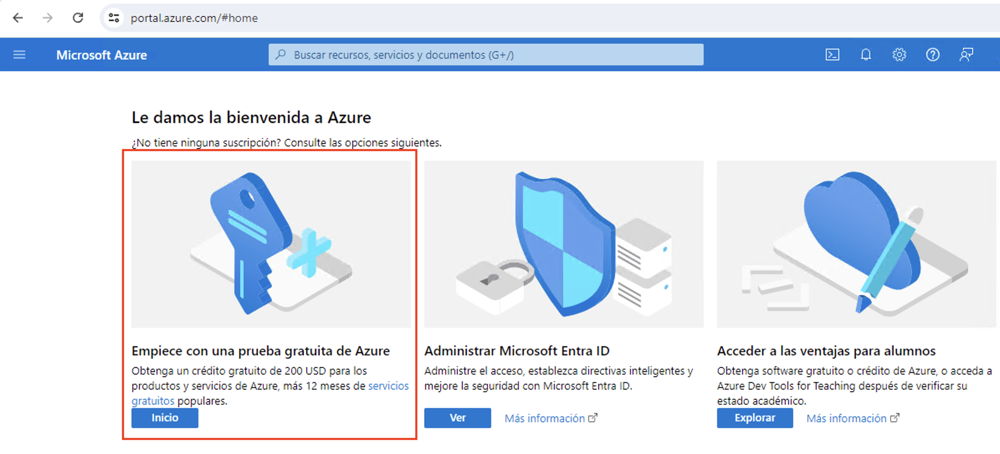
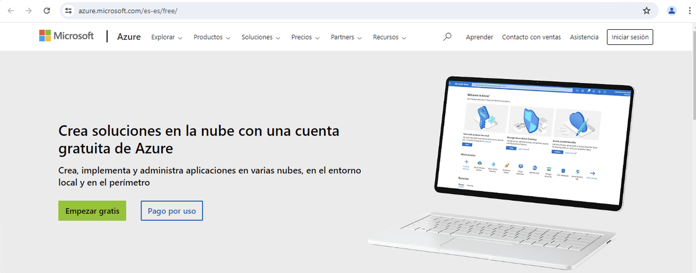
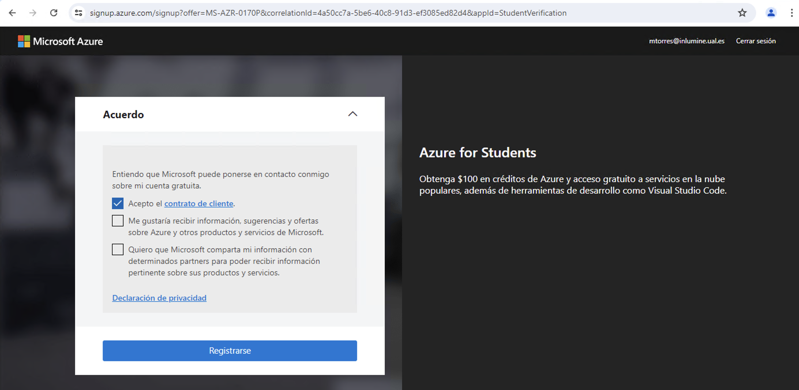
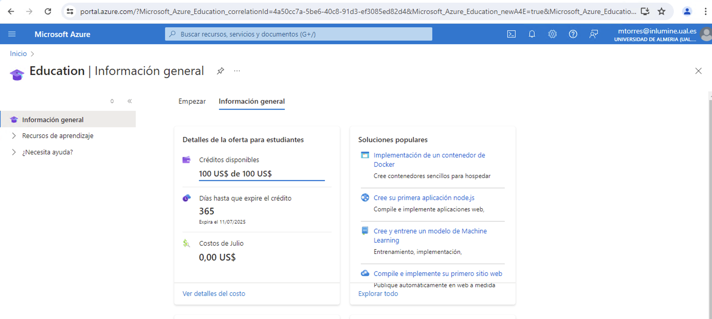

////
Codificación, idioma, tabla de contenidos, tipo de documento
////
:encoding: utf-8
:lang: es
:toc: right
:toc-title: Tabla de contenidos
:keywords: Selenium end-to-end testing
:doctype: book
:icons: font

////
/// activar btn:
////
:experimental:

:source-highlighter: rouge
:rouge-linenums-mode: inline

// :highlightjsdir: ./highlight

:figure-caption: Fig.

////
Nombre y título del trabajo
////
= Suscripción a Azure para estudiantes
Cloud Computing - Máster en Tecnologías y Aplicaciones en Ingeniería Informática
José Joaquín Cañadas <jjcanada@ual.es> y Manuel Torres <mtorres@ual.es>

// Entrar en modo no numerado de apartados
:numbered!: 

[abstract]
== Resumen
////
COLOCA A CONTINUACIÓN EL RESUMEN
////
En este tutorial se indica cómo obtener una suscripción de Microsoft Azure para Estudiantes para el uso en la asignatura. Tras el registro y la activación de la suscripción podrás consultar el crédito disponible para usar libremente en servicios de Microsoft Azure.

.Objetivos
* Obtener una suscripción de Microsoft Azure para Estudiantes.
* Consultar el crédito disponible en la suscripción.

Microsoft Azure ofrece una suscripción gratuita para estudiantes. La suscripción es de uso personal, tiene una duración de un año y un saldo de 100 USD. Este saldo se puede utilizar para consumir los servicios de Azure, como máquinas virtuales, bases de datos, almacenamiento, etc. Si se supera el saldo de 100 USD, los servicios se desactivarán automáticamente y no se realizarán cargos adicionales. Para evitar la interrupción de los servicios, se puede cambiar a una suscripción de pago en cualquier momento. **Sin embargo, no se recomienda cambiar a una suscripción de pago en el entorno de desarrollo de la asignatura. Es responsabilidad de los estudiantes gestionar adecuadamente el saldo de la suscripción gratuita para evitar cargos adicionales.**

A continuación se detallan los pasos necesarios para solicitar una suscripción gratuita de Azure para estudiantes:

. Iniciar sesión en https://portal.azure.com[Portal de Azure] con las credenciales de la cuenta de estudiante. Aparecerá el panel de inicio de Azure. Si es la primera vez que se accede a Azure, se mostrará un mensaje de bienvenida y se indicará que hay que crear una suscripción. Empezaremos accediendo a la suscripción gratuita de Azure para estudiantes.
+

. Solicitar la suscripción gratuita para estudiantes de 100 USD. Esta suscripción permite acceder a todos los servicios de Azure durante un año sin coste alguno. Para ello, se debe hacer clic en el botón "Suscríbase ahora" que aparece en la parte superior de la pantalla.
. Se abrirá una nueva ventana en la que se deberá hacer clic en el botón "Empezar gratis". Aparecerá un formulario que habrá que rellenar con algunos datos personales mínimos.
+

. Aceptar los términos y condiciones de la suscripción gratuita y hacer clic en el botón "Siguiente". Se mostrará un mensaje de confirmación de la suscripción.
+

+
[NOTE]
====
Para aumentar la seguridad de la cuenta de Azure, se recomienda habilitar la autenticación de dos factores. Para ello, se debe hacer clic en el icono de la cuenta de usuario que aparece en la parte superior derecha de la pantalla y seleccionar la opción "Configuración de la cuenta". En la sección "Seguridad", se debe hacer clic en el enlace "Configurar autenticación de dos factores" y seguir las instrucciones que se muestran en pantalla.
====
. Una vez completado el proceso de suscripción, se accederá al panel de inicio de servicios académicos de Azure. La pestaña de "Información general" mostrará un resumen de la suscripción, incluyendo el saldo disponible y la fecha de caducidad de la suscripción.
+

[NOTE]
====
Para acceder a los servicios académicos de Azure, basta con introducir el término "Education" en el cuadro de búsqueda de recursos, servicios y documentos de Azure. Aparecerá un listado de servicios y recursos académicos disponibles para su uso.
====
