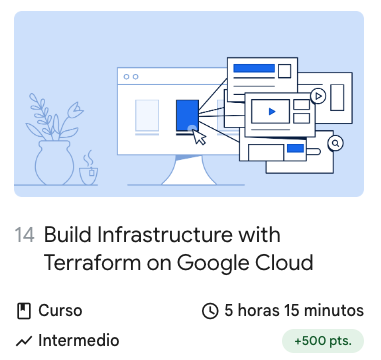

////
NO CAMBIAR!!
Codificación, idioma, tabla de contenidos, tipo de documento
////
:encoding: utf-8
:lang: es
:toc: right
:toc-title: Tabla de contenidos
:doctype: book
:linkattrs:

////
Nombre y título del trabajo
////
# Planificación recomendada para seguir el Programa Especializado: Cloud Engineer Learning Path - Máster en Ingeniería Informática
Manuel Torres y Francisco José García <mtorres@ual.es> <paco.garcia@ual.es>

image::images/di.png[]

// NO CAMBIAR!! (Entrar en modo no numerado de apartados)
:numbered!: 

[abstract]
== Resumen
////
COLOCA A CONTINUACION EL RESUMEN
////

La ruta de aprendizaje de _Cloud Engineer Learning Path_ es un programa especializado que proporciona una introducción a Google Cloud Platform y sus servicios. Este programa especializado está diseñado para personas que desean aprender a diseñar, desarrollar y administrar soluciones en la nube en Google Cloud Platform. Para el desarrollo de esta ruta se usará el cupón activado en la cuenta de Google Cloud Platform Education proporcionado en la asignatura. Este documento proporciona una planificación recomendada para seguir el programa especializado _Cloud Engineer Learning Path_ durante el desarrollo de la asignatura de Cloud Computing.

////
COLOCA A CONTINUACION LOS OBJETIVOS
////
.Objetivos
* Ofrecer una planificación ordenada para poder desarrollar de forma equilibrada los cursos del programa especializado _Architecting with Google Compute Engine_

// Entrar en modo numerado de apartados
:numbered:

## Planificación recomendada

[NOTE]
====
Para evitar acumulación de trabajo en la fecha de vencimiento se recomienda ir siguiendo cada actividad en su semana y así resolver las dudas planteadas en las clases presenciales.
====

:numbered!: 

### Semana 1

image::images/GoogleCloudPlatformFundamentalsCoreInfrastructure.png[width=33%]

* Presentación de Google Cloud Platform
* Introducción a Google Cloud Platform
* Máquinas virtuales en la nube

### Semana 2

image::images/EssentialGoogleCloudInfrastructureFoundation.png[width=33%] 

* Introducción
* Módulo 1: Introducción a GCP
* Módulo 2: Redes virtuales

### Semana 3

image::images/EssentialGoogleCloudInfrastructureFoundation.png[width=33%] 

* Módulo 3: Máquinas virtuales

image::images/EssentialGoogleCloudInfrastructureCoreServices.png[width=33%]

* Introducción
* Módulo 1: Cloud IAM

### Semana 4

image::images/GoogleCloudPlatformFundamentalsCoreInfrastructure.png[width=33%]

* Storage in the Cloud

image::images/EssentialGoogleCloudInfrastructureCoreServices.png[width=33%]

* Módulo 2: Servicios de almacenamiento y base de datos
* Módulo 3: Administración de recursos
* Módulo 4: Supervisión de recursos

### Semana 5

image::images/ElasticGoogleCloudInfrastructureScalingAndAutomation.png[width=33%]

* Introducción
* Módulo 1: Interconexión de redes
* Módulo 2: Balanceo de cargas y ajuste de escala automático
* Módulo 3: Automatización de la infraestructura

### Semana 6

image::images/GoogleCloudPlatformFundamentalsCoreInfrastructure.png[width=33%]

* Contenedores en la nube
* Aplicaciones en la nube
* Desarrollo, implementación y supervisión en la nube
* Macrodatos y aprendizaje automático en la nube
* Resumen y repaso

### Semana 7

image::images/GettingStartedWithGoogleKubernetesEngine.png[width=33%]

* Introducción a contenedores y Kubernetes
* Arquitectura de Kubernetes
* Operqaciones en Kubernetes
* Resumen

image::images//GettingStartedWithTerraformForGoogleCloud.png[width=33%]

* Introducción
* Introducción a Terraform para Google Cloud
* Escribiendo código de infraestructura para Google Cloud
* Organización y reutilización de configuraciones con módulos Terraform
* Introducción al estado de Terraform

### Semana 8

* Creación de infraestructura en Google Cloud con Terraform
