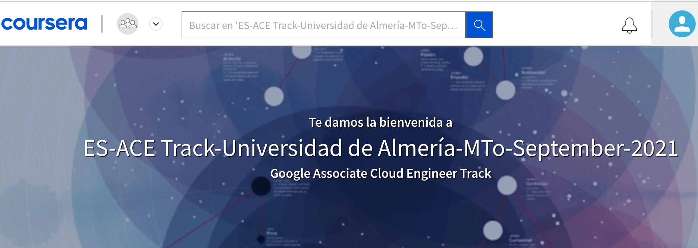

////
NO CAMBIAR!!
Codificación, idioma, tabla de contenidos, tipo de documento
////
:encoding: utf-8
:lang: es
:toc: right
:toc-title: Tabla de contenidos
:doctype: book
:linkattrs:

////
Nombre y título del trabajo
////
# Resumen del Programa Especializado: Architecting with Google Compute Engine
Cloud Computing - Máster en Tecnologías y Aplicaciones en Ingeniería Informática
José Joaquín Cañadas y Manuel Torres <jjcanada@ual.es> <mtorres@ual.es>

image::images/di.png[]

// NO CAMBIAR!! (Entrar en modo no numerado de apartados)
:numbered!: 

[abstract]
== Resumen
////
COLOCA A CONTINUACION EL RESUMEN
////

El programa especializado _Architecting with Google Compute Engine_ ofrece una forma de completar de forma práctica y con tecnología globalmente aceptada en la industria los conocimientos en Cloud Computing. El programa consta de 5 cursos que sientan las bases para la configuración, despliegue y mantenimiento de soluciones cloud con tolerancia a fallos y alta disponibilidad.

////
COLOCA A CONTINUACION LOS OBJETIVOS
////
.Objetivos
* Conocer el programa especializado _Architecting with Google Compute Engine_

// Entrar en modo numerado de apartados
:numbered:

## Introducción

El programa _Architecting with Google Compute Engine_ propociona los conocimientos necesarios para avanzar en tu carrera y formación para la preparación a la reconocidacertificación _Google Cloud Associate Cloud Engineer_.

Acceso al https://www.coursera.org/programs/ace-track-1414-s-5uslk[programa especializado de Architecting with Google Compute Engine]

## Programa de cursos

.Cursos del programa 
[width="100%",options="header,footer"]
|====================
| Curso |  Duración
| 1. Google Cloud Platform Fundamentals: Core Infrastructure |  2 semanas
| 2. Essential Cloud Infrastructure: Foundation |  1 semana
| 3. Essential Cloud Infrastructure: Core Services |  1 semana
| 4. Elastic Cloud Infrastructure: Scaling and Automation |  1 semana
| 5. Reliable Cloud Infrastructure: Design and Process |  2 semanas
|====================

### Google Cloud Platform Fundamentals: Core Infrastructure

En este curso, se presentan conceptos y terminología importantes para trabajar con Google Cloud Platform (GCP). No solo aprenderá sobre muchos de los servicios de procesamiento y almacenamiento disponibles en Google Cloud Platform (como Google App Engine, Google Compute Engine, Google Kubernetes Engine, Google Cloud Storage, Google Cloud SQL y BigQuery), sino que también los comparará. Aprenderá sobre herramientas de administración de recursos y políticas, como la jerarquía de Google Cloud Resource y Google Cloud Identity and Access Management. Los labs prácticos le proporcionan habilidades básicas para trabajar con GCP.

image::images/GoogleCloudPlatformFundamentalsCoreInfrastructure.png[width=33%]

#### Presentación de Google Cloud Platform

Google Cloud Platform ofrece cuatro tipos principales de servicios: Compute, Storage, Big Data y Machine Learning. Este curso se enfoca en los primeros dos y en las herramientas de redes de la nube privada virtual (VPC) de Google. En este módulo, se orienta a los participantes sobre los conceptos básicos de Google Cloud Platform. Se hace un seguimiento sobre la evolución de la computación en la nube y se explica por qué el enfoque de Google es único. En el módulo, se introducen los conceptos estructurales clave de regiones y zonas.

14 videos, 2 lecturas, 2 cuestionarios de práctica

#### Introducción a Google Cloud Platform

Los clientes de GCP utilizan proyectos para organizar los recursos que usan. Además, usan Google Cloud Identity and Access Management, también conocido como "IAM", para controlar lo que cada uno puede hacer con esos recursos. Utilizan varias tecnologías para conectarse con GCP. Este módulo aborda cada uno de estos temas y se introduce un servicio llamado Cloud Launcher, que es una forma sencilla de comenzar con GCP.

8 videos, 2 cuestionarios de práctica

#### Máquinas virtuales en la nube

Compute Engine le permite ejecutar máquinas virtuales en la infraestructura global de Google. En este módulo, se aborda el funcionamiento de Compute Engine, con énfasis en las redes virtuales de Google.

5 videos, 2 cuestionarios de práctica

#### Almacenamiento en la nube

Todas las aplicaciones necesitan almacenar datos. Diferentes aplicaciones y cargas de trabajo necesitan distintas soluciones de almacenamiento y bases de datos. En este módulo, se describen y se diferencian las opciones de almacenamiento principales de GCP: Cloud Storage, Cloud SQL, Cloud Spanner, Cloud Datastore y Google Bigtable.

8 videos, 4 cuestionarios de práctica

#### Contenedores en la nube

Los contenedores son interoperables y simples. Además, permiten un escalamiento fluido y detallado. Kubernetes es una capa de organización para contenedores. Kubernetes Engine es el servicio de Kubernetes, una solución administrada escalable que se ejecuta en la infraestructura de Google. Usted dirige la creación de un clúster y Kubernetes Engine programa sus contenedores dentro de los clústeres y los administra automáticamente de acuerdo con los requisitos que define. En este módulo, se explica cómo funciona Kubernetes Engine y de qué manera ayuda a implementar aplicaciones en los contenedores.

5 videos, 3 cuestionarios de práctica

#### Aplicaciones en la nube

App Engine es una oferta de plataforma como servicio ("PaaS"). La plataforma de App Engine administra el hardware y la infraestructura de redes necesarios para ejecutar su código. App Engine proporciona servicios incorporados que necesitan muchas aplicaciones web. En este módulo, se describe cómo funciona App Engine.

5 videos, 2 cuestionarios de práctica

#### Desarrollo, implementación y supervisión en la nube

Herramientas populares para desarrollar, implementar y supervisar el trabajo en GCP. Los clientes también tienen opciones de herramientas en cada una de estas tres áreas que están estrechamente integradas con GCP. En este módulo, se abordan esas herramientas.
4 videos, 2 cuestionarios de práctica

#### Macrodatos y aprendizaje automático en la nube

Las ofertas de macrodatos y aprendizaje automático en GCP están diseñadas para ayudar a los clientes a aprovechar al máximo los datos. Estas herramientas están diseñadas para que sea sencillo y práctico incorporarlas a sus aplicaciones. En este módulo, se describen los servicios disponibles de macrodatos y aprendizaje automático, y se explica la utilidad de cada uno.

8 videos

#### Resumen y repaso

En este módulo, se repasan los servicios de GCP abordados en este curso y se les recuerda a los participantes las diferencias entre ellos. En el módulo, se comparan los servicios de procesamiento de GCP, los servicios de almacenamiento de GCP y las funciones de red de VPC importantes de Google.

2 videos

### Essential Google Cloud Infrastructure: Foundation

En este curso acelerado a pedido de 1 semana, se brinda a los participantes una introducción a los servicios de infraestructura y plataforma flexibles y completos que proporciona Google Cloud Platform. Mediante una serie de clases por video, demostraciones y labs prácticos, los participantes pueden explorar y, también, implementar elementos de soluciones, incluidos componentes de infraestructura, como redes, máquinas virtuales y servicios de aplicaciones. Aprenderá a usar Google Cloud Platform mediante Console y Cloud Shell. También se familiarizará con la función de un arquitecto de nube, enfoques para el diseño de la infraestructura y la configuración de redes virtuales con una nube privada virtual (VPC), proyectos, redes, subredes, direcciones IP, rutas y reglas de firewall.

image::images/EssentialGoogleCloudInfrastructureFoundation.png[width=33%]

#### Introducción

En este módulo, presentaremos la especialización Architecting with Google Compute Engine. Está destinada a arquitectos de soluciones de nube, ingenieros de DevOps y personas que deseen usar GCP para crear soluciones nuevas o integrar sistemas, infraestructuras y entornos de aplicaciones existentes con un enfoque en Compute Engine.

1 video , 2 lecturas

#### Módulo 1: Introducción a GCP

En este módulo, le brindaremos una introducción a GCP. Para ello, nos basaremos en lo que aprendió sobre la infraestructura de GCP en la introducción del curso.

9 videos

#### Módulo 2: Redes virtuales

En este módulo, primero presentaremos la nube privada virtual (VPC), que es la funcionalidad de redes administrada de Google para sus recursos de Cloud Platform. Luego, desglosaremos las redes en sus componentes fundamentales, que son proyectos, redes, subredes, direcciones IP, rutas y reglas de firewall, y analizaremos los precios de red.

15 videos

#### Módulo 3: Máquinas virtuales

En este módulo, analizaremos las instancias de máquinas virtuales, o VM. Comenzaremos con los conceptos básicos de Compute Engine y seguiremos con un lab breve y rápido para que se familiarice aún más con la creación de máquinas virtuales. Luego, exploraremos las distintas opciones de memoria y CPU que le permiten crear diversas configuraciones. A continuación, observaremos imágenes y las distintas opciones de discos disponibles con Compute Engine. Después, analizaremos acciones muy comunes de Compute Engine que podría encontrar en su trabajo diario. Seguiremos luego con un lab detallado que explora muchas de las funciones y los servicios que abordamos en este módulo.

16 videos , 1 lectura

### Essential Google Cloud Infrastructure: Core Services

This accelerated on-demand course introduces participants to the comprehensive and flexible infrastructure and platform services provided by Google Cloud with a focus on Compute Engine. Through a combination of video lectures, demos, and hands-on labs, participants explore and deploy solution elements, including infrastructure components such as networks, systems and applications services. This course also covers deploying practical solutions including customer-supplied encryption keys, security and access management, quotas and billing, and resource monitoring.

image::images/EssentialGoogleCloudInfrastructureCoreServices.png[width=33%]

#### Introducción

En este módulo, presentaremos la especialización Architecting with Google Compute Engine. Está destinada a arquitectos de soluciones de nube, ingenieros de DevOps y personas que deseen usar GCP para crear soluciones nuevas o integrar sistemas, infraestructuras y entornos de aplicaciones existentes con un enfoque en Compute Engine.

1 video , 2 lecturas

#### Módulo 1: Cloud IAM

En este módulo, analizaremos Cloud Identity and Access Management (Cloud IAM). Cloud IAM es un sistema sofisticado basado en nombres de direcciones de tipo de correo electrónico, funciones de tipo de trabajo y permisos detallados. Si está familiarizado con IAM a partir de otras implementaciones, descubra las diferencias que implementó Google a fin de facilitar la administración de IAM y lograr que sea más segura.

12 videos

#### Módulo 2: Servicios de almacenamiento y base de datos

En este módulo, analizaremos los servicios de almacenamiento y base de datos en GCP. Todas las aplicaciones necesitan almacenar información, ya sean datos comerciales, contenido multimedia para transmitir o datos de sensores de dispositivos.

13 videos

#### Módulo 3: Administración de recursos

En este módulo, analizaremos la administración de recursos. En GCP, se facturan los recursos. Por ello, si los administra, podrá controlar los costos correspondientes. Existen varios métodos para controlar el acceso a los recursos, así como cuotas que limitan el consumo.

9 videos

#### Módulo 4: Supervisión de recursos

En este módulo, obtendrá una descripción general de las opciones de supervisión de recursos disponibles en GCP. Las funciones que se analizan en este módulo están basadas en Stackdriver, un servicio que ofrece supervisión, registro y diagnóstico para sus aplicaciones.

13 videos, 1 lectura

### Elastic Google Cloud Infrastructure: Scaling and Automation

En este curso acelerado a pedido, se brinda a los participantes una introducción a los servicios de infraestructura y plataforma flexibles y completos que proporciona Google Cloud Platform. Mediante una serie de clases por video, demostraciones y labs prácticos, los participantes pueden explorar y, también, implementar elementos de soluciones, incluidos componentes de infraestructura, como redes, sistemas y servicios de aplicaciones. Además, se tratan temas como la implementación de soluciones prácticas, la interconexión segura de redes, el balanceo de cargas, el ajuste de escala automático, la automatización de infraestructura y los servicios administrados.

image::images/ElasticGoogleCloudInfrastructureScalingAndAutomation.png[width=33%]

#### Introducción

En este módulo, presentaremos la especialización Architecting with Google Compute Engine. Está destinada a arquitectos de soluciones de nube, ingenieros de DevOps y personas que deseen usar GCP para crear soluciones nuevas o integrar sistemas, infraestructuras y entornos de aplicaciones existentes con un enfoque en Compute Engine.

1 video , 2 lecturas

#### Módulo 1: Interconexión de redes

En este módulo, nos enfocaremos en los productos de conectividad híbrida de GCP: Cloud VPN, Cloud Interconnect y el intercambio de tráfico. Además, analizaremos las opciones para compartir redes de VPC dentro de GCP.

11 videos

#### Módulo 2: Balanceo de cargas y ajuste de escala automático

En este módulo, trataremos los distintos tipos de balanceadores de cargas disponibles en GCP. Además, analizaremos los grupos de instancias administrados y sus configuraciones de ajuste de escala automático, que pueden usarse en las configuraciones de balanceo de cargas.

16 videos

#### Módulo 3: Automatización de la infraestructura

En este módulo, veremos cómo usar Deployment Manager para automatizar la implementación de la infraestructura y GCP Marketplace para lanzar soluciones de infraestructura. En el lab de este módulo, usará Deployment Manager o Terraform para implementar una red de VPC, instancias de VM y una regla de firewall.

8 videos

#### Módulo 4: Servicios administrados

En este módulo, brindaremos una descripción general de BigQuery, Cloud Dataflow, Cloud Dataprep de Trifacta y Cloud Dataproc. Todos esos servicios se usan para el análisis de datos, pero, dado que ese no es el enfoque de la serie de este curso, no habrá labs en este módulo. En cambio, haremos una breve demostración para ilustrar qué tan sencillo es usar un servicio administrado.

8 videos, 1 lectura

### Reliable Google Cloud Infrastructure: Design and Process

En este curso, los participantes aprenderán a compilar soluciones altamente confiables y eficientes en Google Cloud mediante el uso de patrones de diseño comprobados. Es la continuación de los cursos Architecting with Google Compute Engine o Architecting with Google Kubernetes Engine y, por lo tanto, se supone que los participantes tienen experiencia práctica con las tecnologías que se tratan en esos cursos. Mediante una serie de presentaciones, actividades de diseño y labs prácticos, los participantes aprenderán a definir y equilibrar los requisitos técnicos y comerciales para diseñar implementaciones de Google Cloud que sean muy confiables, seguras y rentables y que, además, tengan alta disponibilidad.

image::images/ReliableGoogleCloudInfrastructureDesignAndProcess.png[width=33%]

#### Introducción

Le damos la bienvenida al curso Reliable Google Cloud Infrastructure: Design and Process. Obtenga más información sobre la estructura del curso y su contenido.

3 videos , 1 lectura

#### Cómo definir los servicios

9 videos

#### Diseño y arquitectura de los microservicios

En este módulo, presentaremos la arquitectura de aplicaciones y el diseño de microservicios

11 videos

#### Automatización de DevOps

En este módulo, presentaremos la automatización de DevOps, un factor clave para lograr coherencia, confiabilidad y velocidad durante la implementación.

7 videos

#### Cómo elegir las soluciones de almacenamiento

En este módulo, analizaremos las soluciones de almacenamiento y datos de Google Cloud, y veremos cómo seleccionar la más adecuada para cumplir con sus requisitos técnicos y comerciales.
8 videos

#### Las arquitecturas de Google Cloud y redes híbridas

En este módulo, analizaremos las arquitecturas de red de Google Cloud así como las arquitecturas híbridas.

9 videos

#### Cómo implementar aplicaciones en Google Cloud

En este módulo, analizaremos las diferentes opciones para implementar aplicaciones en Google Cloud. Google Cloud ofrece varias plataformas de implementación, y no siempre resulta claro cuál elegir.

6 videos

#### Cómo diseñar sistemas confiables

En este módulo, analizaremos cómo diseñar sistemas confiables.

9 videos

#### Seguridad

En este módulo, abordaremos el tema de la seguridad. Google lleva más de 20 años brindando servicios seguros en la nube. Hay una fuerte creencia de que la seguridad mejora la innovación. En la arquitectura de la nube, la seguridad es lo más importante; el resto es secundario.

9 videos

#### Mantenimiento y supervisión

10 videos , 2 lecturas