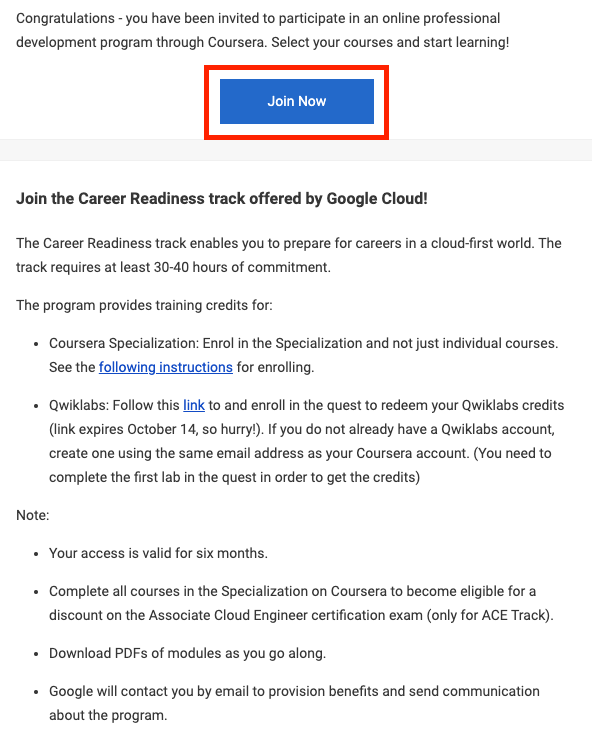
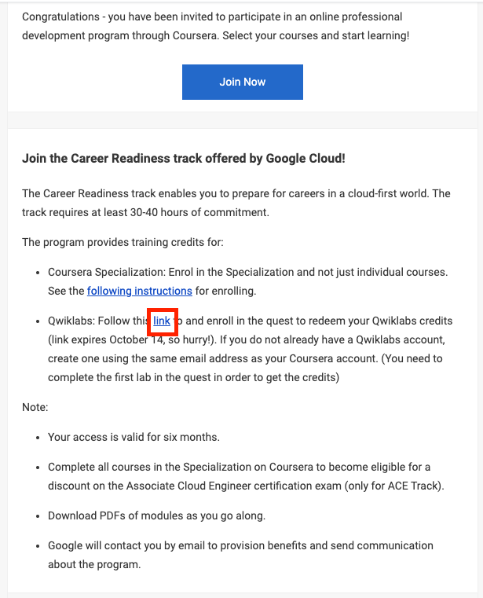
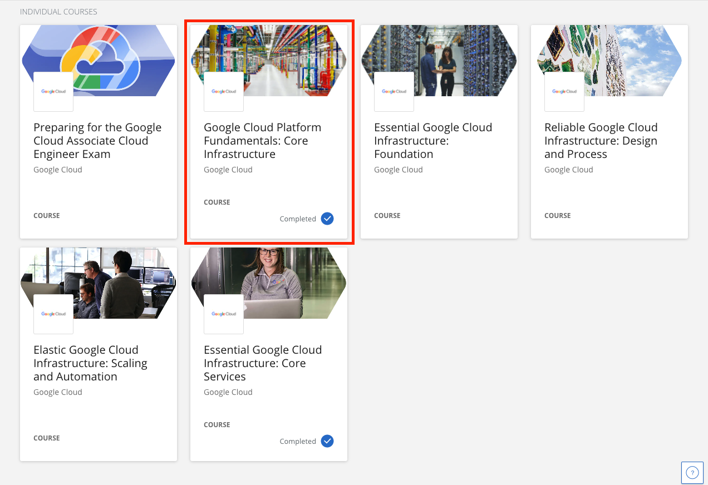

////
NO CAMBIAR!!
Codificación, idioma, tabla de contenidos, tipo de documento
////
:encoding: utf-8
:lang: es
:toc: right
:toc-title: Tabla de contenidos
:doctype: book
:linkattrs:

////
Nombre y título del trabajo
////
# Primeros pasos del Associate Cloud Engineer Track ofrecido por Google Cloud
Cloud Computing - Máster en Tecnologías y Aplicaciones en Ingeniería Informática
José Joaquín Cañadas y Manuel Torres <jjcanada@ual.es> <mtorres@ual.es>

image::images/di.png[]

// NO CAMBIAR!! (Entrar en modo no numerado de apartados)
:numbered!: 

[abstract]
== Resumen
////
COLOCA A CONTINUACION EL RESUMEN
////
Las actividades no presenciales de la asignatura Cloud Computing permiten acercarte al uso de los servicios de Google Cloud. Aquí se presenta el programa de cursos del Google Associate Engineer Track ofrecido a través de las plataformas Coursera y Qwiklabs.

////
COLOCA A CONTINUACION LOS OBJETIVOS
////
.Objetivos
* Conocer el programa Google Associate Engineer
* Unirte al Google Associate Engineer Track de Coursera
* Registarte en Qwiklabs para el desarrollo de prácticas del Track

// Entrar en modo numerado de apartados
:numbered:

## Introducción

Dentro de las actividades no presenciales de la asignatura Cloud Computing del Máster en Tecnologías y Aplicaciones en Ingeniería Informática de la UAL se va a seguir el https://www.coursera.org/programs/ace-track-907-s-3pm27[Google Associate Engineer Track]. Está formado por los cursos siguientes:

* https://www.coursera.org/programs/ace-track-907-s-3pm27?authProvider=ace-circuit&collectionId=&currentTab=CATALOG&productId=h9LqVq-lEeauxBIk_RF-8A&productType=course&showMiniModal=true[Google Cloud Platform Fundamentals: Core Infrastructure]
* https://www.coursera.org/programs/ace-track-907-s-3pm27?authProvider=ace-circuit&collectionId=&currentTab=CATALOG&productId=sK6edjzPEees8grTZvuQjA&productType=course&showMiniModal=true[Essential Google Cloud Infrastructure: Foundation]
* https://www.coursera.org/programs/ace-track-907-s-3pm27?authProvider=ace-circuit&collectionId=&currentTab=CATALOG&productId=9xG8yUo7EeeJdBL3H0RODg&productType=course&showMiniModal=true[Essential Google Cloud Infrastructure: Core Services]
* https://www.coursera.org/programs/ace-track-907-s-3pm27?authProvider=ace-circuit&collectionId=&currentTab=CATALOG&productId=G4Fvqko8Eee4pw7hxA2o1A&productType=course&showMiniModal=true[Elastic Google Cloud Infrastructure: Scaling and Automation]
* https://www.coursera.org/programs/ace-track-907-s-3pm27?authProvider=ace-circuit&collectionId=&currentTab=CATALOG&productId=Hdkvqa-VEeemsBI74hnnzA&productType=course&showMiniModal=true[Reliable Google Cloud Infrastructure: Design and Process]

Los cursos se siguen a través de la plataforma https://www.coursera.org/[Coursera] y se complementan con laboratorios prácticos que se siguen a través de https://www.qwiklabs.com[Quiklabs].

[NOTE]
====
Estos cursos permiten la preparación para la certificación https://www.coursera.org/programs/ace-track-907-s-3pm27?authProvider=ace-circuit&collectionId=&currentTab=CATALOG&productId=W6zo0XaPEemMiBJD8adJBg&productType=course&showMiniModal=true[Google Cloud Associate Cloud Engineer]. Los estudiantes de la asignatura tienen un cupón de descuento para la realización del examen.
====

## Coursera

Coursera es una plataforma de cursos online. En ella se alojan los cursos oficiales de Google Cloud Platform del programa de especialización Associate Cloud Engineer track que vamos a realizar en la asignatura dentro de las actividades no presenciales.

Para acceder a Coursera, primero comprueba que has recibido un email de Coursera con la invitación al programa de especialización. En el email, haz clic en el enlace `Join Now` y regístrate usando tu nombre completo y tu email de la UAL.

## Qwiklabs

Qwiklabs una plataforma online de laboratorios prácticos (labs) que nos permite realizar las actividades prácticas incluidas en los cursos. Qwiklabs crea unas credenciales temporales de Google Cloud para realizar cada uno de los labs, que son válidas únicamente durante un tiempo limitado establecido para la realización del lab. Así, no tendremos que consumir crédito de nuestro cupón académico de 50$ (Más adelante veremos https://ualmtorres.github.io/AsignaturaCloudComputing/Docs/Tema1/ActivacionCuentaGoogleCloud.html[cómo activar el cupón en GCP]). Además, los resultados de realizar los labs en Qwiklabs se integran con el curso de Coursera, asignando la puntuación correspondiente.

Haz click en el link que aparece en el email, y regístrate en Qwiklabs con tu email de la UAL.

 
Tras inciar sesión, accede a tu perfil y comprueba que tienes crédito disponible.

image::images/QwiklabsCredit.png[]

## Acceso a los cursos 

Accede al https://www.coursera.org/programs/ace-track-907-s-3pm27[Google Associate Cloud Engineer Track] de Coursera. Tendrás acceso al programa con los 5 cursos:

image::images/GoogleAssociateCloudEngineerTrack.png[]

Comienza por **Google Cloud Platform Fundamentals: Core Infrastructure**. ¡Disfrútalo!

