////
NO CAMBIAR!!
Codificación, idioma, tabla de contenidos, tipo de documento
////
:encoding: utf-8
:lang: es
:toc: right
:toc-title: Tabla de contenidos
:doctype: book
:linkattrs:

:figure-caption: Fig.

////
Nombre y título del trabajo
////
# Creación de una base de datos MySQL en Google Cloud Platform
Cloud Computing - Máster en Tecnologías y Aplicaciones en Ingeniería Informática
José Joaquín Cañadas y Manuel Torres <jjcanada@ual.es> <mtorres@ual.es>

// NO CAMBIAR!! (Entrar en modo no numerado de apartados)
:numbered!: 

[abstract]
== Resumen
////
COLOCA A CONTINUACION EL RESUMEN
////
 

////
COLOCA A CONTINUACION LOS OBJETIVOS
////
.Objetivos
* Crear una instancia MySQL a la medida de las necesidades
* Configurar las conexiones permitidas a la instancia MySQL
* Crear un segmento en Cloud Storage 
* Añadir archivos a un segmento Cloud Storage mediante la API de Cloud Storage
* Usar el cliente MySQL de Cloud Shell
* Crear una máquina virtual
* Realizar una conexión SSH a la máquina virtual

// Entrar en modo numerado de apartados
:numbered:

## Introducción

En este tutorial crearemos una base de datos MySQL de recursos reducidos y la inicializaremos con un script SQL disponible en una URL.

## Crear la instancia MySQL

. En el Menú de navegación ir a la categoría `BASES DE DATOS` y seleccionar `SQL`. Esto permite crear bases de datos MySQL, PostgreSQL y SQL Server totalmente gestionadas. Google Cloud se encargará de las tareas de replicación, actualización de parches, y demás.

+
image::images/CloudSQLInicio.png[]

+
[NOTE]
====
Cloud SQL también permite la migración desde una base de datos MySQL existente a partir de su dirección IP pública. 
====

+
. Seleccionar `Crear Instancia`. Aparecerán los distintos tipos de bases de datos disponibles en Google Cloud SQL. Elegir `MySQL`.

+
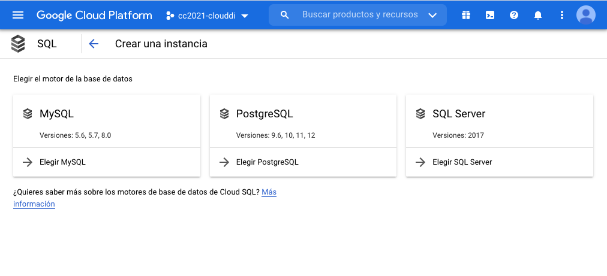

+
. En el cuadro de dialogo `Crear una instancia de MySQL` configurar valores para el `ID de instancia` (p.e. `sg`) y la contraseña de `root`

+
[IMPORTANT]
====
Esta base de datos tendrá una IP pública y será accesible desde cualquier parte del mundo. Hay que tener especial cuidado al elegir la contraseña de `root` para evitar un acceso no deseado.
====

+ 
. Seleccionar `Mostrar opciones de configuración`.

.. Desplegar `Tipo de máquina y almacenamiento`. Como es para una prueba, en `Tipo de máquina` elegir una máquina estándar (`db-n1-standard-1`) con 1 vCPU y 3.75 GB de RAM. 
.. En `Tipo de almacenamiento` dejar `SSD` con una capacidad de almacenamiento de `10 GB`. 
.. Desactivar la opción `Habilitar los aumentos automáticos de almacenamiento` para evitar el creacimiento del almacenamiento.
.. Dejar las opciones predeterminadas de `Copias de seguridad, recuperación y alta disponibilidad`.
.. Dejar las opciones predeterminadas de `Mantenimiento`.

+
Finalmente, el tipo de máquina y almacenamiento deben quedar así

+
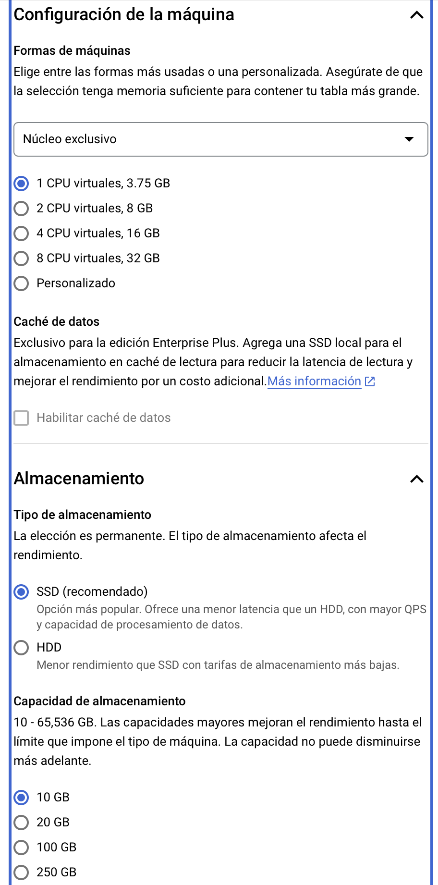

+
[IMPORTANT]
====
Las opciones iniciales de Tipo de máquina y almacenamiento pueden ser muy elevadas para nuestras necesidades. Revisar que no sea una máquina virtual con 4 vCPU, 24 GB de RAM y 100 GB de SSD para datos como el de la figura. Hay que prestar atención a la configuración y ajustarla para no tener posteriormente sorpresas en la factuación.

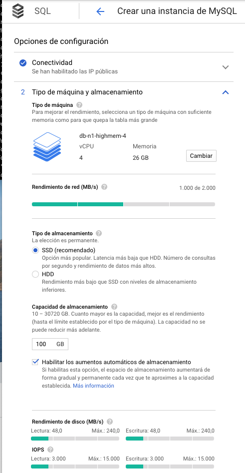
====

+
. Finalmente crear la instancia

Unos minutos más tarde estará disponible la instancia.

[NOTE]
====
Una vez creada una instancia en Cloud SQL se podrá redimensionar tanto hacia arriba como hacia abajo. Ajustar hacia abajo será una opción permitida siempre que se pueda acomodar la instancia inicial en la instancia final.
====

## Configurar las conexiones

De forma predeterminada, la instancia MySQL no admite conexiones externas. Podremos realizar una configuración para permitir la conexión desde una dirección, desde varias direcciones, desde un segmento de red, desde varios segmentos de red o desde todo Intenet. La configuración de las conexiones se realizará usando la notación https://es.wikipedia.org/wiki/Classless_Inter-Domain_Routing#:~:text=Classless%20Inter%2DDomain%20Routing%20o,de%20interpretar%20las%20direcciones%20IP.[CIDR] 

En nuestro ejemplo, aunque sea lo menos seguro permitiremos conexiones desde cualquier lugar. Para ello seguiremos estos pasos.

. Seleccionar `Conexiones` en el menú de la instancia MySQL.

+
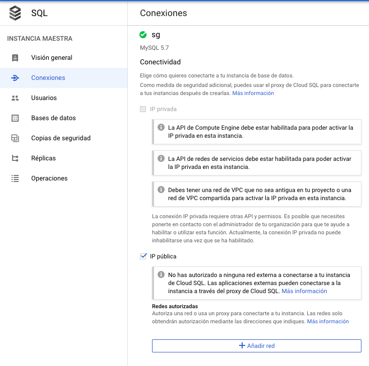

+
. Pulsar sobre `Añadir red`
. Asignaremos un nombre descriptivo (p.e. `Internet`)
. Configurar la máscara de red a `0.0.0.0/0` que representa cualquier dirección IP.

+
image::images/MySQLAñadirRed.png[]

+
. Pulsar `Listo`. Aparecerá la red añadida.

+
image::images/MySQLRedAñadida.png[]

+
. Guardar los cambios.

## Importación de datos

En el enlace siguiente está disponible un  https://gist.githubusercontent.com/ualmtorres/eb328b653fcc5964f976b22c320dc10f/raw/448b00c44d7102d66077a393dad555585862f923/init.sql[script de inicialización de base de datos SG]. Se trata de una base de datos de artículos deportivos (*Sporting Goods*).

Tenemos dos opciones principales para importar el script SQL:

* Importarlo con el asistente de Cloud SQL desde Cloud Storage
* Usar un cliente MySQL para lanzar el script. En esta opción caben dos opciones
** Lanzar el script desde Cloud Shell
** Lanzar el script desde una máquina virtual

Veamos cada una de las formas de hacerlo.

[NOTE]
====
https://cloud.google.com/shell?hl=es[Cloud Shell] es una máquina virtual pequeña de administración que incorpora el SDK de Google Cloud y otras herramientas de interés (p.e. bash, vim, clientes de MySQL, Docker y Kubernetes). 
====

### Almacenar el script SQL en Cloud Storage

Cloud Storage proporciona almacenamiento de objetos, una forma de almacenar cualquier tipo de archivos a los que se proporciona una URL que permite su acceso universal. Los archivos son organizados en segmentos o _buckets_.

. En el menú `ALMACENAMIENTO` seleccionar `Storage`. Aparecerá el Navegador de Storage mostrando una lista vacía de segmentos (_buckets_)

+
image::images/StorageInicial.png[]

. Seleccionar `Crear Segmento`. En el cuadro de diálogo asignar un nombre al segmento. Debe tratarse de un nombre único ya que se usará para componer la URL de los objetos (archivos) que contenga. Revisar el resto de opciones y crear el segmento.

+

+
.Subida de archivos al segmento
****
Se pueden subir archivos al segmento desde nuestro propio ordenador usando la interfaz web o desde una terminal donde esté instalada la API de Cloud Storage. Cloud Shell se inicializa con dicha API y se podrán copiar archivos desde Cloud Shell a un segmento de Cloud Storage. Previamente se habrán descargado los archivos a Cloud Shell.
****

+ 
. Abrir Cloud Shell para descargar el script SQL y copiarlo al segmento.

+
. Descargar a Cloud Shell el https://gist.githubusercontent.com/ualmtorres/eb328b653fcc5964f976b22c320dc10f/raw/448b00c44d7102d66077a393dad555585862f923/init.sql[script SQL de creación de la base de datos SG].

+
[source, bash]
----
$ curl https://gist.githubusercontent.com/ualmtorres/eb328b653fcc5964f976b22c320dc10f/raw/448b00c44
d7102d66077a393dad555585862f923/init.sql --output init.sql
----

+
. Google Cloud nos advierte que necesita incluir nuestras credenciales en Cloud Shell. Pulsaremos `Autorizar`.

+
image::images/CloudShellAutorizar.png[]

+
. Copiar el archivo `init.sql` de Cloud Shell al segmento

+
[source, bash]
----
gsutil cp init.sql gs://cloud-computing-mtorres/init.sql <1>
----
<1> Cambiar el nombre del segmento `cloud-computing-mtorres por el que hayas usado

+
Si se abre el segmento se puede comprobar que el archivo ha sido copiado al segmento desde Cloud Shell.

+
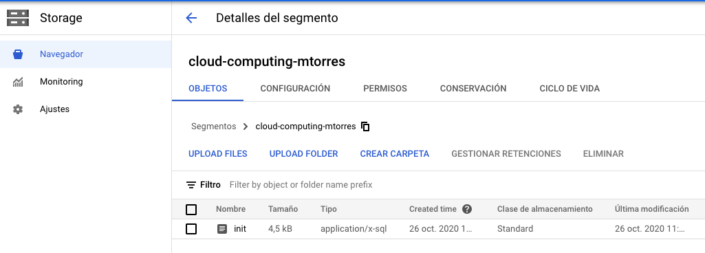

+
[NOTE]
====
Más información sobre copia de archivos en la https://cloud.google.com/storage/docs/gsutil/commands/cp[documentación oficial sobre `gsutil`, el CLI que permite acceder a Cloud Storage desde la línea de comandos.
====

+
. Abrir la instancia MySQL, seleccionar `Importar` en la barra de herramientas superior. 
. Pulsar `Examinar` para seleccionar el archivo

+
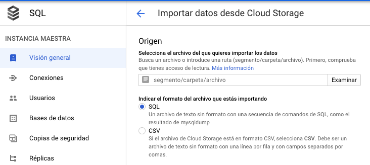

+
. Seleccionar el archivo `init.sql` del segmento

+
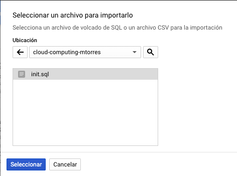

+
El archivo quedará seleccionado.

+
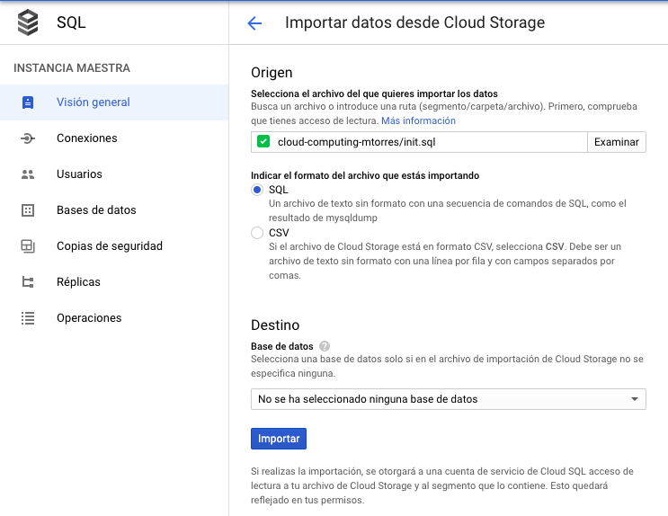

+
Pulsar el botón `Importar`. La base de datos `SG` quedará importada.

+
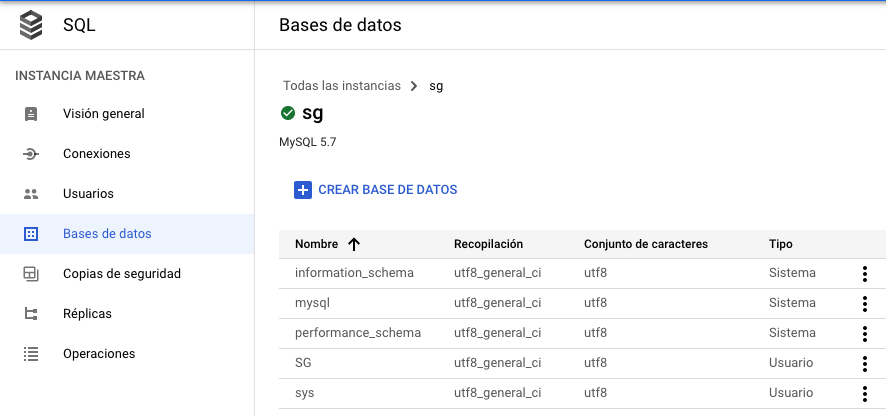

### Usar el cliente MySQL de Cloud Shell

Cloud Shell incorpora un cliente MySQL. Desde él podremos iniciar una sesión en la instancia MySQL y también podremos importar el script de la base de datos SG.

. Abrir Cloud Shell para descargar el script SQL.

. Google Cloud nos advierte que necesita incluir nuestras credenciales en Cloud Shell. Pulsaremos `Autorizar`.

+
image::images/CloudShellAutorizar.png[]

+
. Descargar a Cloud Shell el https://gist.githubusercontent.com/ualmtorres/eb328b653fcc5964f976b22c320dc10f/raw/448b00c44d7102d66077a393dad555585862f923/init.sql[script SQL de creación de la base de datos SG].

+
[source, bash]
----
$ curl https://gist.githubusercontent.com/ualmtorres/eb328b653fcc5964f976b22c320dc10f/raw/448b00c44
d7102d66077a393dad555585862f923/init.sql --output init.sql
----

+
. Ejecutar el script de creación de la base de datos SG en la instancia MySQL

[source, bash]
----
mysql -h 34.122.xxx.xxx -u root -p < init.sql
----

### Creación de una máquina virtual

Una opción más laboriosa y quizá menos justificada en este caso consiste en crear una máquina virtual en la que se instalará el cliente MySQL para la carga de datos e interacción con la base de datos.

[NOTE]
====
La opción de crear una instancia para instalar el cliente MySQL no es necesario porque esa función la podemos realizar con Cloud Shell, que ya incorpora un cliente MySQL entre su set de herramientas de administración útiles.
====

. En el Menú de navegación seleccionar en el bloque `COMPUTE` la opción `Compute Engine`. En el submenú seleccionar `Instancias de VM`.

+
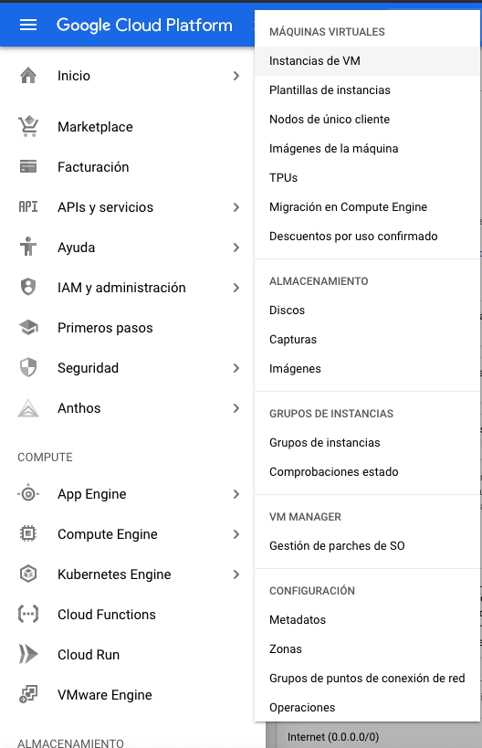

+
. Si no hay ninguna máquina virtual creada aparecerá una descripción de Compute Engine. Pulsaremos el botón `Crear`.

+
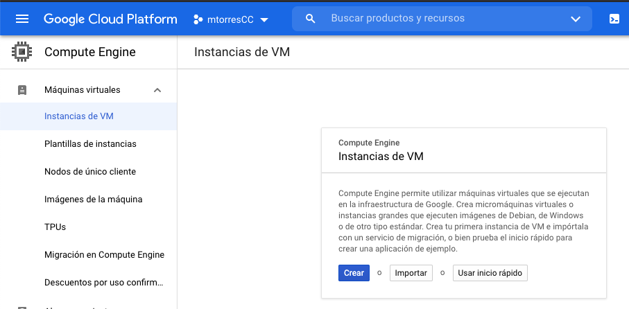

+
. Asignar un nombre a la instancia (p.e. `basica`) dejando las opciones de región y zona predeterminadas.
. Modificar la configuración de la máquina virtual indicando
* Serie N1
* Tipo de máquina `g1-small (1 vCPU y 1.7 GB RAM)

+
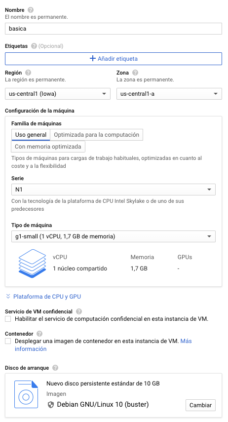

+
. Pulsar el botón `Crear`.

+
Tras unos instantes, la máquina virtual estará creada y contará con una dirección IP a la que nos podríamos conectar mediante SSH descargando previamente el certificado.

+
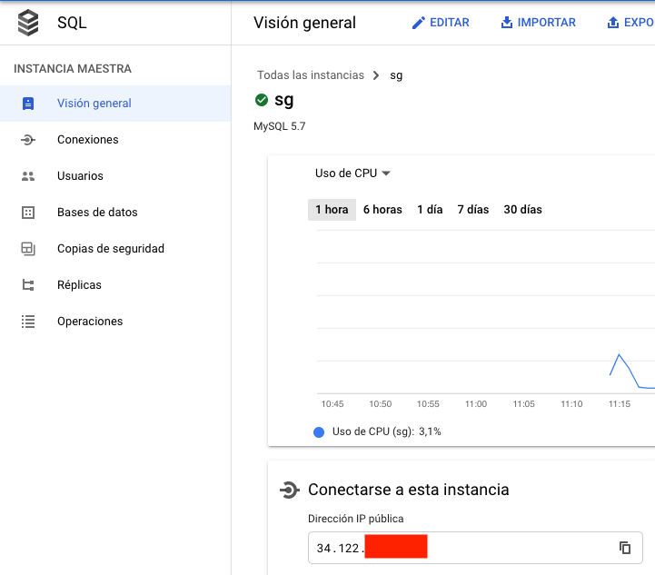

+
No obstante, es más sencillo abrir directamente la consola SSH que ofrece Google Cloud y que se muestra a la derecha de cada instancia de la lista.

+
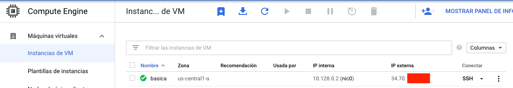

+
Esto abrirá una sesión SSH en nuestro ordenador.

+
image::images/InstanciaTerminal.png[]

+ 
En esa terminal instalaremos el cliente MySQL con estos comandos

+
[source, bash]
----
sudo apt-get update
sudo apt-get install default-mysql-client <1>
----
<1> Debian Buster usa el paquete `default-mysql-client` como cliente MySQL

+
A continuación se siguen los mismos pasos que se siguieron para crear la base de datos desde Cloud Shell (descargar el script y ejecutarlo con el cliente MySQL).

+
. Descargar a la máquina virtual el https://gist.githubusercontent.com/ualmtorres/eb328b653fcc5964f976b22c320dc10f/raw/448b00c44d7102d66077a393dad555585862f923/init.sql[script SQL de creación de la base de datos SG].

+
[source, bash]
----
$ curl https://gist.githubusercontent.com/ualmtorres/eb328b653fcc5964f976b22c320dc10f/raw/448b00c44
d7102d66077a393dad555585862f923/init.sql --output init.sql
----

+
. Ejecutar el script de creación de la base de datos SG en la instancia MySQL

[source, bash]
----
mysql -h 34.122.xxx.xxx -u root -p < init.sql
----

## Conexión a la instancia MySQL

En los pasos anteriores hemos creado una instancia MySQL y se ha inicializado una base de datos (`SG`) a partir de un script siguiendo tres opciones:

* Guardando el script en un segmento de Cloud Storage e importándolo con la herramienta de importación.
* Guardando el script en Cloud Shell y cargando el script desde el cliente MySQL incoporado de serie en Cloud Shell.
* Creando una máquina virtual para instalar un cliente MySQL. Posteriormente, se ha guardado el script en la máquina virtual y se ha lanzado contra la instancia MySQL.

A continuación abriremos una Cloud Shell o una sesión SSH en la máquina virtual. Desde la terminal invocaremos al cliente MySQL y conectaremos con la instancia MySQL usando las credenciales

[source, bash]
----
mysql -h 34.122.xxx.xxx -u root -p
----

Una vez iniciada la sesión podremos mostrar las bases de datos y ver que `SG` se encuentra creada

[source, bash]
----
mysql> show databases; <1>
+--------------------+
| Database           |
+--------------------+
| information_schema |
| SG                 |
| mysql              |
| performance_schema |
| sys                |
+--------------------+
5 rows in set (0.10 sec)

mysql> use SG <2>
Reading table information for completion of table and column names
You can turn off this feature to get a quicker startup with -A
Database changed

mysql> show tables; <3>
+--------------+
| Tables_in_SG |
+--------------+
| s_customer   |
+--------------+
1 row in set (0.11 sec)

mysql> select id, name <4>
    -> from s_customer
    -> limit 10;
+-----+----------------------+
| id  | name                 |
+-----+----------------------+
| 201 | One Sport            |
| 202 | Deportivo Caracas    |
| 203 | New Delhi Sports     |
| 204 | Ladysport            |
| 205 | Kim's Sporting Goods |
| 206 | Sportique            |
| 207 | Tall Rock Sports     |
| 208 | Muench Sports        |
| 209 | Beisbol Si!          |
| 210 | Futbol Sonora        |
+-----+----------------------+
10 rows in set (0.10 sec)
----
<1> Mostrar las bases de datos
<2> Seleccionar la base de datos `SG`
<3> Mostrar las tablas de la base de datos seleccionada
<4> Mostrar unos datos de ejemplo

