////
NO CAMBIAR!!
Codificación, idioma, tabla de contenidos, tipo de documento
////
:encoding: utf-8
:lang: es
:toc: right
:toc-title: Tabla de contenidos
:doctype: book
:linkattrs:

:figure-caption: Fig.

////
Nombre y título del trabajo
////
# Creación de un servidor web en Azure
Cloud Computing - Máster en Ingeniería Informática
Manuel Torres <mtorres@ual.es>

image::images/di.png[]

// NO CAMBIAR!! (Entrar en modo no numerado de apartados)
:numbered!: 

[abstract]
== Resumen
////
COLOCA A CONTINUACION EL RESUMEN
////
En este tutorial se describe cómo crear un servidor web en Azure. Se partirá de cero y se creará la infraestructura necesaria para alojar una página web. Básicamente, se creará una red y una máquina virtual. La máquina virtual se configurará en el arranque con un script de inicio que instalará un servidor web Apache. Además, se abrirán los puertos necesarios en el cortafuegos de Azure para permitir el acceso a la máquina virtual por SSH y a la página web desde un navegador. También se presentará Azure Cloud Shell, un shell interactivo que se puede utilizar para administrar los recursos de Azure. Por último, se mostrará cómo crear un disco adicional y conectarlo a la máquina virtual.

////
COLOCA A CONTINUACION LOS OBJETIVOS
////
.Objetivos
* Crear una red virtual en Azure.
* Crear una máquina virtual en Azure configurada con un script de inicio.
* Añadir claves SSH a la máquina virtual.
* Abrir los puertos necesarios en el cortafuegos de Azure.
* Activar Azure Cloud Shell.
* Crear un disco adicional y conectarlo a la máquina virtual.

// Entrar en modo numerado de apartados
:numbered:

## Introducción

En este tutorial se desribe cómo crear desde cero una máquina virtual en Azure de recursos reducidos para ilustrar cómo utilizar un cloud público como Azure para mostrar la potencia y las ventajas de la computación en la nube. Para ello, será necesario disponer de unos recursos previamente configurados, como son un _grupo de recursos_ y una _red virtual_. La máquina virtual se configurará en el arranque con un script de inicio que instalará un servidor web Apache. Además, se abrirán los puertos necesarios en el cortafuegos de Azure para permitir el acceso a la máquina virtual por SSH y a la página web desde un navegador. También se presentará Azure Cloud Shell, un shell interactivo que se puede utilizar para administrar los recursos de Azure. Por último, se mostrará cómo crear un disco adicional y conectarlo a la máquina virtual.

## Preparación de la infraestructura básica

Para comenzar, es necesario disponer de una cuenta en Azure. Si no se dispone de una, se puede crear una cuenta gratuita en Azure como estudiante de la UAL en link:../Tema0/Azure/crear-suscripcion-AzureParaEstudiantes.html[este enlace].

Una vez se dispone de una cuenta en Azure, se debe crear un _grupo de recursos_ y una _red virtual_.

### Creación de un grupo de recursos

Un _grupo de recursos_ es un contenedor lógico en el que se implementan y se administran los recursos de Azure (p.e. máquinas virtuales, bases de datos, aplicaciones web, etc.). Cuando se crea un recurso en Azure, se debe asignar a un grupo de recursos. Los recursos de Azure se pueden implementar en diferentes regiones de Azure. Un grupo de recursos puede contener recursos que se encuentran en diferentes regiones, pero todos los recursos de un grupo de recursos se encuentran en una única región.

Para crear un grupo de recursos, se debe seguir los siguientes pasos:

1. Seleccionar la opción _Grupos de recursos_ en el menú de la izquierda o buscar _Grupos de recursos_ en la barra de búsqueda.
2. Hacer clic en el botón `+ Crear`.
3. En el formularion indicaremos:
    * Suscripción: Seleccionar la suscripción de Azure for Students.
    * Grupo de recursos: Introducir un nombre para el grupo de recursos (p.e. el nombre de usuario de la UAL `mtorres`).
    * Región: Seleccionar una región cercana a la ubicación del usuario (p.e. `(Europe) France Central`).
4. Hacer clic en el botón `Revisar y crear`.

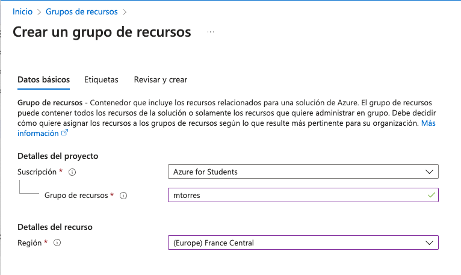

### Creación de una red virtual

Una _red virtual_ es una red que se ha creado en Azure y que se puede utilizar para alojar recursos de Azure. Una red virtual es similar a una red tradicional que se puede utilizar en un centro de datos físico, pero con las ventajas de la escalabilidad y la disponibilidad de Azure.

Para crear una red virtual, una vez que se ha creado un grupo de recursos, se deben seguir los siguientes pasos:

1. Seleccionar la opción _Redes virtuales_ en el menú de la izquierda (si no está disponble, seleccionar `Crear un recurso | Redes | Red virtual | Crear`) o buscar _Redes virtuales_ en la barra de búsqueda.
2. Hacer clic en el botón `+ Crear red`.
3. En el formulario indicaremos lo siguiente en la pestaña de Datos básicos:
    * Suscripción: Seleccionar la suscripción de Azure for Students.
    * Grupo de recursos: Seleccionar el grupo de recursos creado anteriormente. Si no se ha creado un grupo de recursos, se puede crear uno en este paso sobre la marcha.
    * Nombre: Introducir un nombre para la red virtual (p.e. `mtorres-net`).
    * Región: Seleccionar la región del grupo de recursos (p.e. `(Europe) France Central`).

+
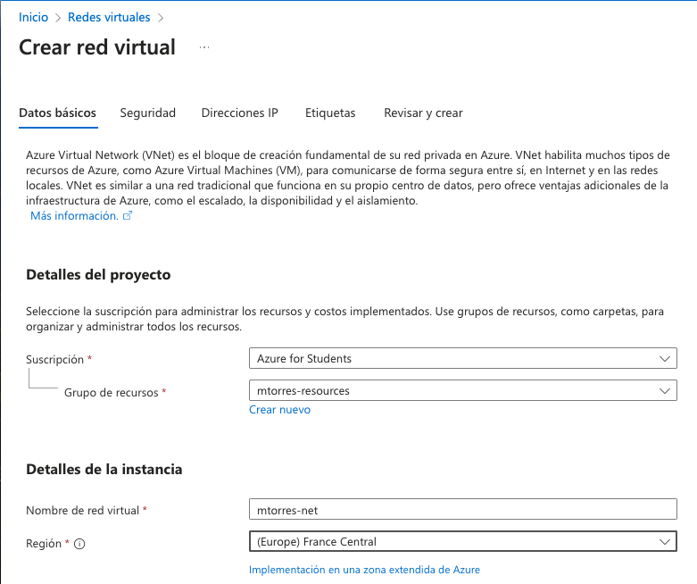

4. En la pestaña de Direcciones IP, se puede dejar la configuración por defecto. En nuestro caso, configuraremos un espacio de direcciones más restringido con CIDR `10.0.0.0/24`

+
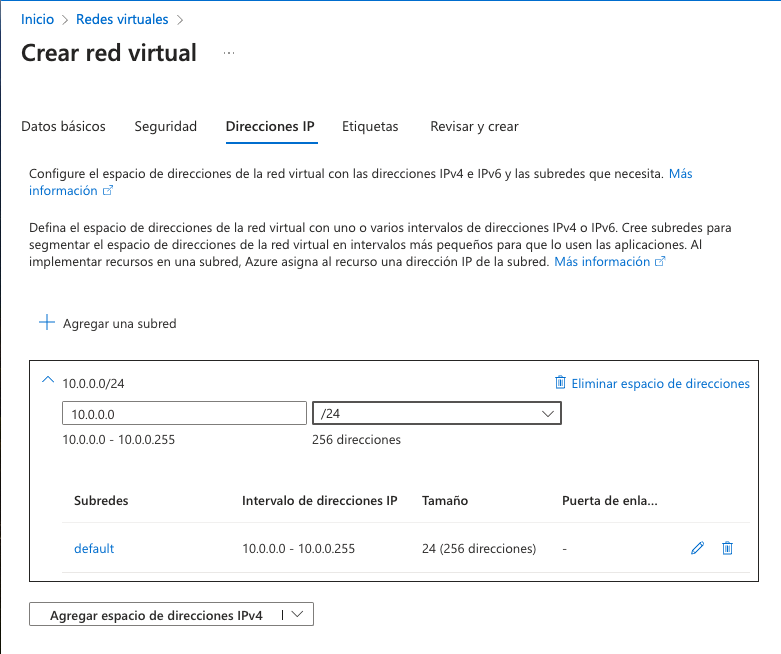

5. Crear la red virtual haciendo clic en el botón `Revisar y crear`.

## Creación de una máquina virtual

Una vez que se ha creado un grupo de recursos y una red virtual, se puede proceder a crear una máquina virtual. Para ello, se deben seguir los siguientes pasos:

1. Seleccionar la opción _Máquinas virtuales_ en el menú de la izquierda o buscar _Máquinas virtuales_ en la barra de búsqueda.
2. Hacer clic en el botón `+ Crear` y seleccionar `Máquina virtual de Azure`.
3. En el formulario indicaremos lo siguiente en la pestaña de Datos básicos:
    * Suscripción: Seleccionar la suscripción de Azure for Students.
    * Grupo de recursos: Seleccionar el grupo de recursos creado anteriormente.
    * Nombre: Introducir un nombre para la máquina virtual (p.e. `web-server`).
    * Región: Seleccionar la región del grupo de recursos (p.e. `(Europe) France Central`).
    * Imagen: Seleccionar una imagen de máquina virtual. En nuestro caso, seleccionaremos una imagen de Ubuntu 24.04 LTS.
    * Arquitectura: Seleccionar una arquitectura de máquina virtual. En nuestro caso, mantendremos la x64.
    * Tamaño: Seleccionar un tamaño de máquina virtual. En nuestro caso, seleccionaremos un tamaño de máquina virtual muy reducido (p.e. `B1 s` con 1 vCPU y 1 GB de RAM).
    * Tipo de autenticación: Mantenemos `Clave pública SSH`.
    * Nombre de usuario: Nombre de usuario de acceso a la máquina virtual (p.e. `mtorres`).
    * Origen de clave pública SSH: Usaremos una clave pública existente (p.e. la que usemos para acceder a OpenStack). Si no se dispone de una clave pública, se puede crear una en este paso.
    * Clave pública SSH: Introducir la clave pública SSH.
    * Puertos de entrada p´blicos: Seleccionar `Permitir los puertos seleccionados` y añadir el puerto 80 (HTTP) y el puerto 22 (SSH).

+
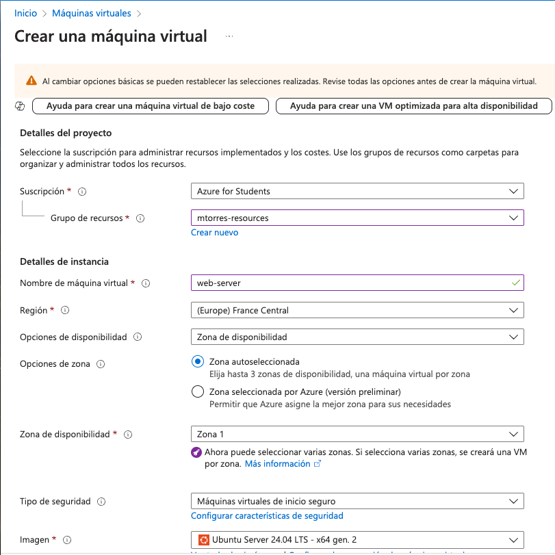

4. En la pestaña de Discos, se puede dejar la configuración por defecto con un tamaño de disco de 30 GB. 

+
[IMPORTANT]
====
Al configurar el disco de la máquina virtual seleccionaremos la casilla `Eliminar disco al eliminar la máquina virtual` para que se elimine el disco de la máquina virtual cuando se elimine la máquina virtual y evitar cargos adicionales. En otras situaciones, se puede dejar el disco para poder reutilizarlo en otra máquina virtual.
====

5. En la pestaña de Redes, se puede dejar la configuración por defecto. En nuestro caso, seleccionaremos la red virtual creada anteriormente. Aparecerá seleccionada la creación de una IP pública y aparecerán los puertos de entrada públicos que hemos configurado anteriormente.

+
[IMPORTANT]
====
Al configurar la red de la máquina virtual seleccionaremos la casilla `Eliminar IP pública y NIC cuando se elimine la VM` para que se elimine la IP pública y la interfaz de red de la máquina virtual cuando se elimine la máquina virtual y evitar cargos adicionales. En otras situaciones, se puede dejar la IP pública y la interfaz de red para poder reutilizarla en otra máquina virtual.
====

6. En la pestaña `Opciones avanzadas` configuraremos el script de inicio de la máquina virtual para instalar Apache. Para ello, activamos la opción `Habilitar datos de usario` y añadiremos el siguiente script en el cuadro `Datos de usuario`:

+
[source,bash]
----
#!/bin/bash

apt-get update
apt-get install -y apache2
----

7. Crear la máquina virtual haciendo clic en el botón `Revisar y crear`.

[NOTE]
====
Es conveniente revisar las opciones ofrecidas en el resto de pestañas para conocer las opciones posibles de configuración de la máquina virtual y realizar los ajustes necesarios en función de las necesidades.
====

Tras unos instantes, la máquina virtual estará creada y Azure nos mostrará un resumen de la máquina virtual creada. La máquina virtual estará en estado `En ejecución` y se podrá acceder a ella a través de SSH en la dirección IP que se ha asignado a la máquina virtual. Además, se podrá acceder a la máquina virtual a través de un navegador web en la dirección IP pública de la máquina virtual. El acceso al servidor web se podrá realizar a través de un navegador web pero tardará unos minutos en estar disponible debido a que tiene actualizar la lista de paquetes e instalar Apache.

### Acceso por SSH mdiante una terminal

Para acceder por SSH a nuestra máquina virtual desde una terminal, deberemos contar con la clave privada que corresponde a la clave pública que hemos añadido a la máquina virtual. Desde una terminal, accederemos a la máquina virtual con el siguiente comando:

[source,bash]
----
ssh [-i <archivo-clave-privada>] <username>@<ip-maquina-virtual>
----

Donde `<username>` es el nombre de usuario que elegimos en la creación de la máquina virtual e `<ip-maquina-virtual>` es la dirección IP asignada a la máquina virtual. La opción `-i` se utiliza para indicar la clave privada que se utilizará para autenticarse en la máquina virtual. Si no se especifica, se utilizará la clave privada por defecto del usuario (normalmente `~/.ssh/id_rsa`). 

La figura siguiente muestra la conexión por SSH a la máquina virtual en una terminal mostrando el disco de la máquina virtual de 30 GB seleccionado en la creación de la máquina virtual.

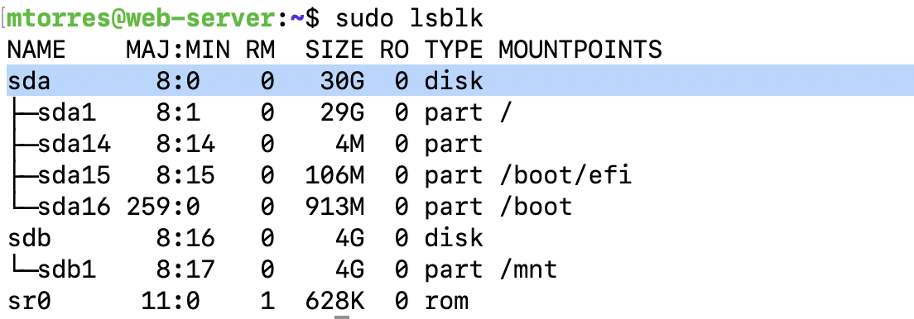

[NOTE]
====
El disco de 4 GB que aparece en `sdb` es un disco temporal que se utiliza para almacenar datos temporales y que se elimina cuando se apaga la máquina virtual. No se debe utilizar para almacenar datos importantes.
====

### Acceso por SSH mediante Azure Cloud Shell

Azure Cloud Shell es un shell interactivo que se puede utilizar para administrar los recursos de Azure. Esta funcionalidad es muy útil, ya que permite el acceso SSH a la máquina virtual sin necesidad de un terminal ni nuestra clave SSH en ocasiones en las que no las tengamos a mano. Se puede acceder a Azure Cloud Shell desde el portal de Azure en la esquina superior derecha. Se puede seleccionar el tipo de shell (Bash o PowerShell) y se puede elegir el tipo de almacenamiento (temporal o persistente). Una vez seleccionadas las opciones, se puede acceder a Azure Cloud Shell. 

Para activar Azure Cloud Shell, seleccionaremos la máquina virtual en el portal Azure y se mostrarán una serie operaciones y opciones. Seleccionaremos la opción `Conectar` y el botón `Seleccionar` del cuadro `SSH mediante CLI de Azure`. A la derecha se abrirá un cuadro de opciones de configuración y la IP de la máquina virtual. Habrá que activar la casilla de verificación para aceptar que se permite el cambio de IP, ya que es efímera y puede cambiar. La figura siguiente ilustra todas las opciones que se han de seleccionar.

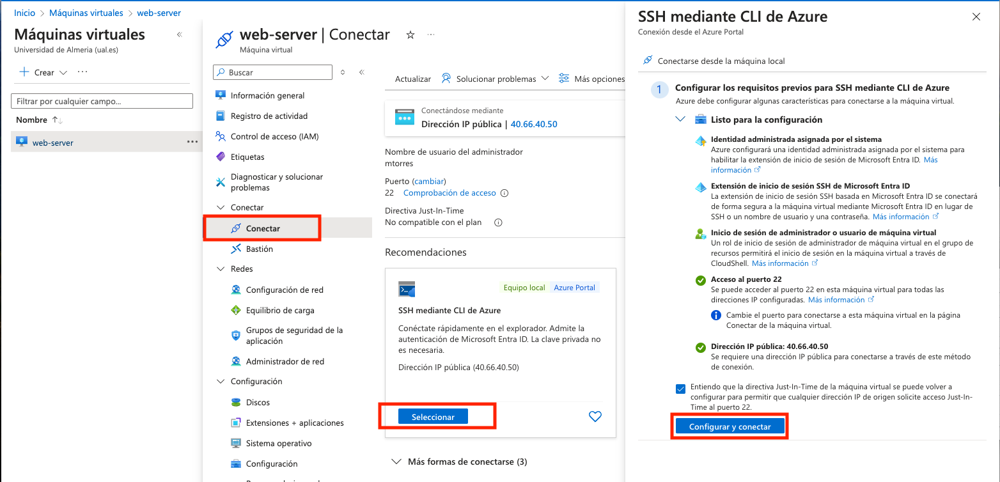

A continuación, nos dará la bienvenida y tendremos que seleccionar si preferimos Bash o PowerShell. Seleccionaremos Bash. La figura siguiente muestra el cuadro de bienvenida de Azure Cloud Shell.

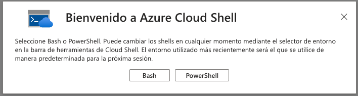

También tendremos que seleccionar una suscripción por si queremos almacenar los datos entre sesiones. La figura siguiente muestra la selección de la suscripción.

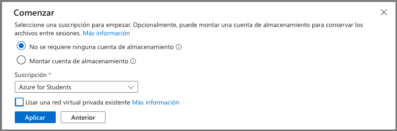

Una vez hechas todas estas selecciones, se abrirá una terminal en la parte inferior. La figura siguiente muestra la shell mostrando de nuevo los discos de la máquina virtual de 30 GB y el disco temporal de 4 GB.

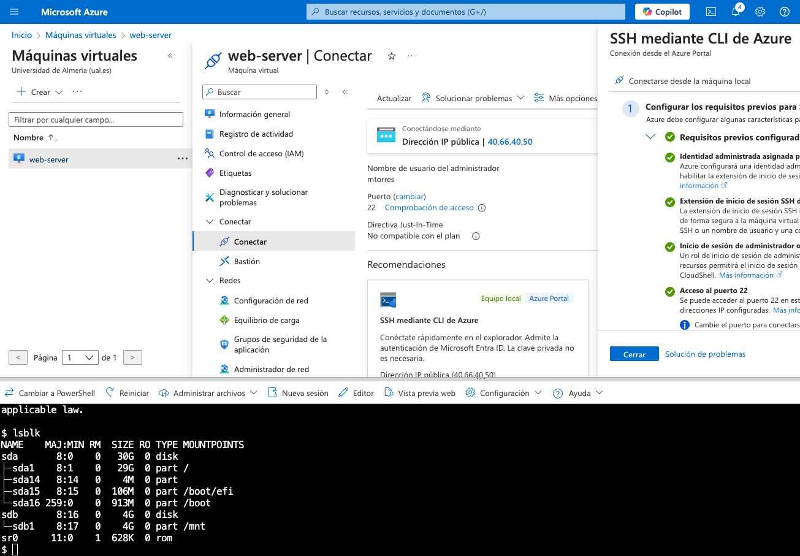

### Acceso al servidor web

La máquina virtual fue configurada en el arranque con un script de inicio que instaló un servidor web Apache. El servidor web Apache estará accesible mediante un navegador web en la dirección IP pública de la máquina virtual. La figura siguiente muestra la página de bienvenida de Apache en un navegador web.

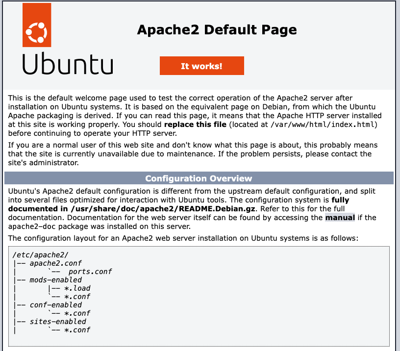

## Almacenamiento básico en Azure

Azure ofrece diferentes tipos de almacenamiento para satisfacer las necesidades de almacenamiento de los recursos de Azure. Hasta ahora, en este tutorial se ha utilizado el almacenamiento por defecto de la máquina virtual, que es un disco de 30 GB. Este disco es un disco persistente que se mantiene incluso cuando se apaga la máquina virtual. Azure ofrece la creación de discos adicionales, almacenamiento en archivos, almacenamiento en blobs, almacenamiento en tablas y almacenamiento en colas. Veamos cómo crear un disco adicional para almacenamiento de bloques que conectaremos a la máquina virtual.

### Creación de un disco adicional

Para crear un disco adicional, se deben seguir los siguientes pasos:

1. Seleccionar la opción _Discos_ en el menú de la izquierda o buscar _Discos_ en la barra de búsqueda.
2. Hacer clic en el botón `+ Crear`.
3. En el formulario indicaremos lo siguiente en la pestaña de Datos básicos:
    * Suscripción: Seleccionar la suscripción de Azure for Students.
    * Grupo de recursos: Seleccionar el grupo de recursos creado anteriormente.
    * Nombre: Introducir un nombre para el disco (p.e. `mtorres-disk-32-gb`).
    * Región: Seleccionar la región del grupo de recursos (p.e. `(Europe) France Central`).
    * Tamaño (GiB): Seleccionar un tamaño de disco y un tipo de almacenamiento económico para esta prueba (p.e. `32 GiB HDD estándar`).

+
[NOTE]
====
En función de la tecnología y el tamaño de disco seleccionado es posible que el disco pueda ser compartido entre varias máquinas virtuales.
====
    

+
La figura siguiente ilustra algunas de las opciones seleccionadas en la pestaña de opciones básicas de creación de discos

+
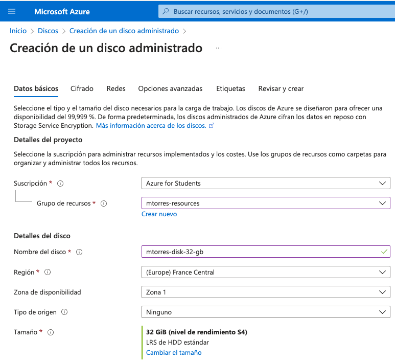

4. Restringir el acceso público y privado desde redes al disco seleccionando la opción `Deshabilitar el acceso público y privado` en la pestaña de `Redes`.

+
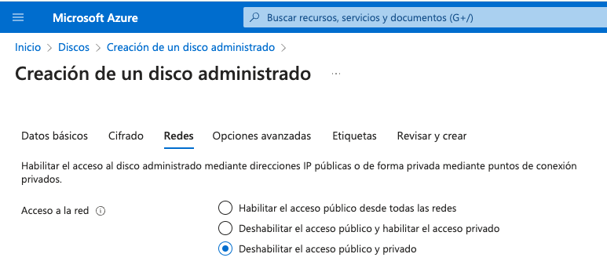

5. Crear el disco haciendo clic en el botón `Revisar y crear`.

Tras unos instantes, el disco estará creado y Azure nos mostrará un resumen del disco creado. 

### Conexión de un disco adicional a una máquina virtual

Una vez creado el disco, se puede conectar a una máquina virtual. Para ello, se debe seleccionar la máquina virtual en el portal de Azure y seleccionar la opción `Conectar` y el botón `Adjuntar discos existentes` en el cuadro de opciones de la máquina virtual. Seleccionar el disco creado anteriormente y hacer clic en el botón `Conectar`. La figura siguiente ilustra las opciones de conexión de un disco a una máquina virtual.

image::images/azure-attach-disk.png[]

Podemos comprobar que el disco se ha conectado a la máquina virtual accediendo a la máquina virtual por SSH y ejecutando el comando `lsblk` para listar los discos conectados a la máquina virtual. La figura siguiente muestra la conexión de un disco de 32 GB a la máquina virtual.

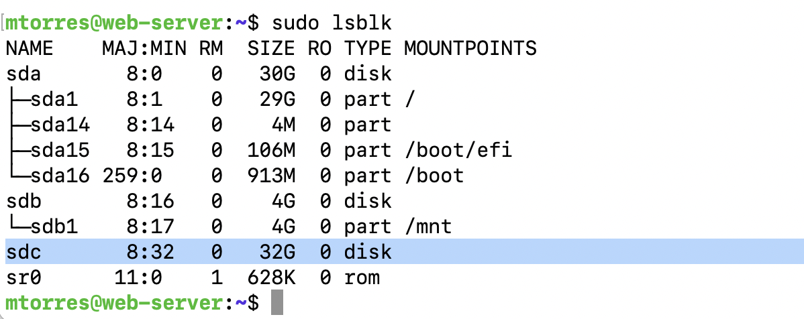

## Conclusiones

En este tutorial se ha descrito cómo crear un servidor web en Azure. Se ha partido de cero y se ha creado la infraestructura necesaria para alojar una página web. Básicamente, se ha creado una red y una máquina virtual. La máquina virtual se ha configurado en el arranque con un script de inicio que ha instalado un servidor web Apache. Además, se han abierto los puertos necesarios en el cortafuegos de Azure para permitir el acceso a la máquina virtual por SSH y a la página web desde un navegador. Se ha mostrado cómo acceder a la máquina virtual por SSH desde una terminal y desde Azure Cloud Shell. Por último, se ha mostrado cómo crear un disco adicional y conectarlo a una máquina virtual.