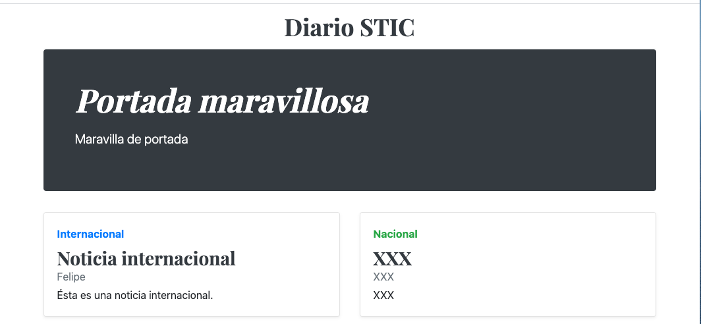

////
NO CAMBIAR!!
Codificación, idioma, tabla de contenidos, tipo de documento
////
:encoding: utf-8
:lang: es
:toc: right
:toc-title: Tabla de contenidos
:doctype: book
:linkattrs:

:figure-caption: Fig.

////
Nombre y título del trabajo
////
# Creación de una base de datos MySQL en Google Cloud Platform
Cloud Computing - Máster en Tecnologías y Aplicaciones en Ingeniería Informática
José Joaquín Cañadas y Manuel Torres <jjcanada@ual.es> <mtorres@ual.es>

// NO CAMBIAR!! (Entrar en modo no numerado de apartados)
:numbered!: 

[abstract]
== Resumen
////
COLOCA A CONTINUACION EL RESUMEN
////
 

////
COLOCA A CONTINUACION LOS OBJETIVOS
////
.Objetivos
* Crear una instancia MySQL a la medida de las necesidades
* Configurar las conexiones permitidas a la instancia MySQL
* Crear un segmento en Cloud Storage 
* Añadir archivos a un segmento Cloud Storage mediante la API de Cloud Storage
* Usar el cliente MySQL de Cloud Shell
* Crear una máquina virtual
* Realizar una conexión SSH a la máquina virtual

// Entrar en modo numerado de apartados
:numbered:

## Introducción

## Modo IaaS

### Crear instancia MySQL

[NOTE]
====
Se está usando el password `secret`.
====

[source, bash]
----
#!/bin/bash
apt-get update
debconf-set-selections <<< 'mysql-server mysql-server/root_password password secret'
debconf-set-selections <<< 'mysql-server mysql-server/root_password_again password secret'
apt-get -y install mysql-server
curl 'https://gist.githubusercontent.com/ualmtorres/eb328b653fcc5964f976b22c320dc10f/raw/448b00c44d7102d66077a393dad555585862f923/init.sql' | mysql -u root -psecret
sed -i 's/bind-address/#bind-address/g' /etc/mysql/mysql.conf.d/mysqld.cnf
service mysql restart
mysql -u root -psecret --execute="GRANT ALL ON SG.* TO root@'%' IDENTIFIED BY 'secret'; FLUSH PRIVILEGES";
----

### Crear instancia PHP

[source, bash]
----
#!/bin/bash
apt-get update
apt-get install -y apache2
sudo apt-get install -y php libapache2-mod-php php-mcrypt
sudo chgrp -R www-data /var/www
sudo chmod -R 775 /var/www
sudo chmod -R g+s /var/www
sudo useradd -G www-data ubuntu
sudo chown -R ubuntu /var/www/
git clone https://github.com/ualmtorres/SGApp.git /var/www/html/SGApp
----

git clone https://github.com/ualmtorres/diariostic.git /var/www/html/diariostic

## App Engine

Abrir Cloud Shell

git clone 
cd diariostic

Crear archivo app.yaml
https://gist.github.com/ualmtorres/5f4c4f4502c9fc9f84c967a59ec4203e

php - S localhost:8080
Abrir `Vista previa web`

Autorizar

Google Cloud nos advierte que necesita incluir nuestras credenciales en Cloud Shell. Pulsaremos `Autorizar`.

image::images/CloudShellAutorizar.png[]

gcloud init
gcloud app deploy

Abrir la URL

Despliegue continuo: https://cloud.google.com/source-repositories/docs/quickstart-triggering-builds-with-source-repositories

