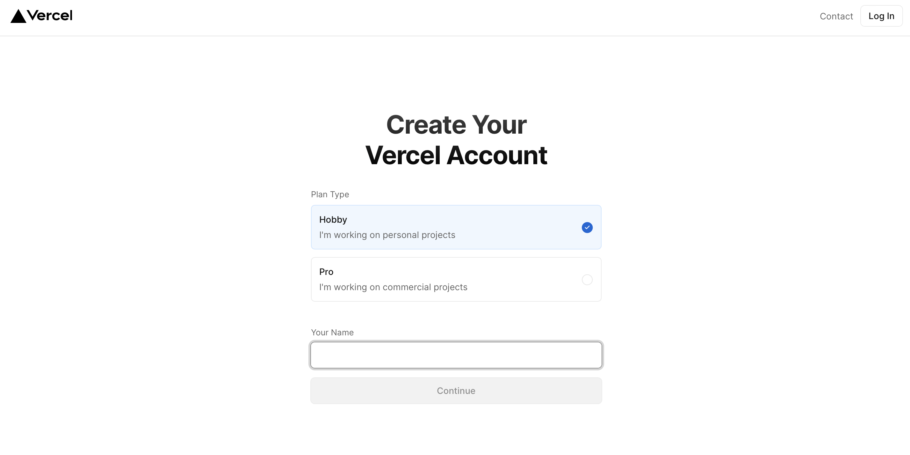
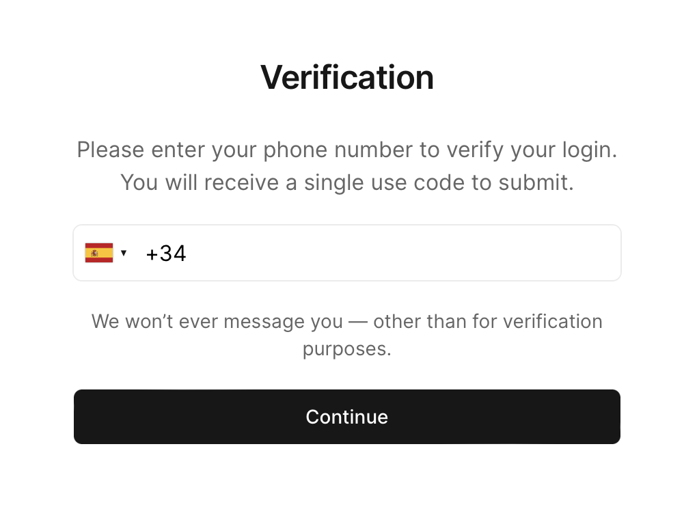
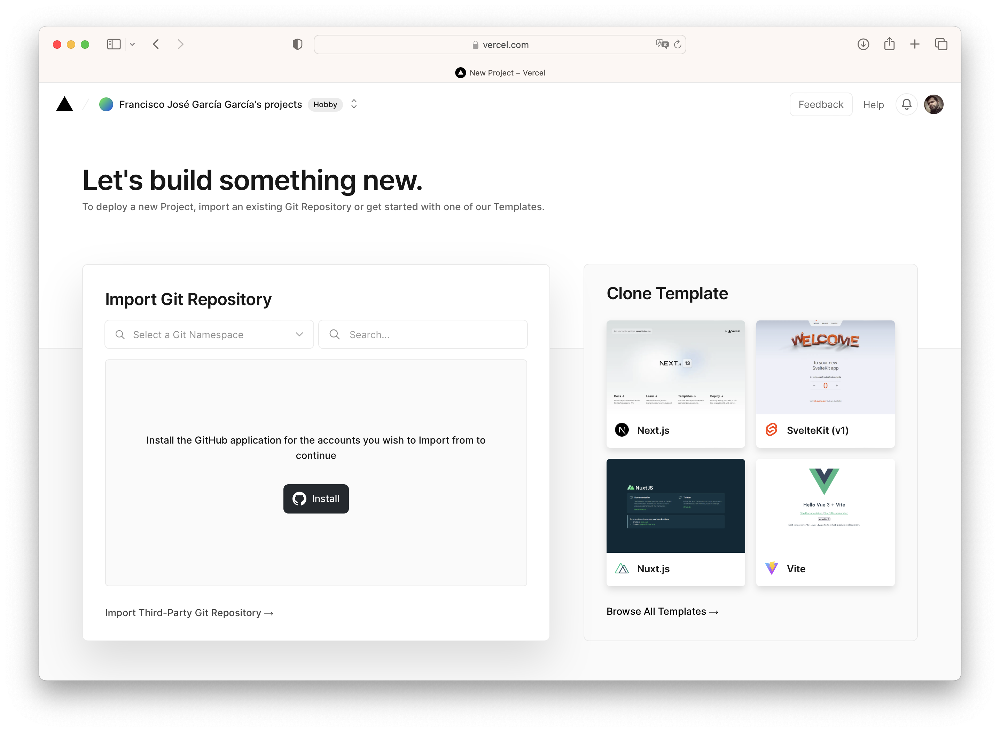
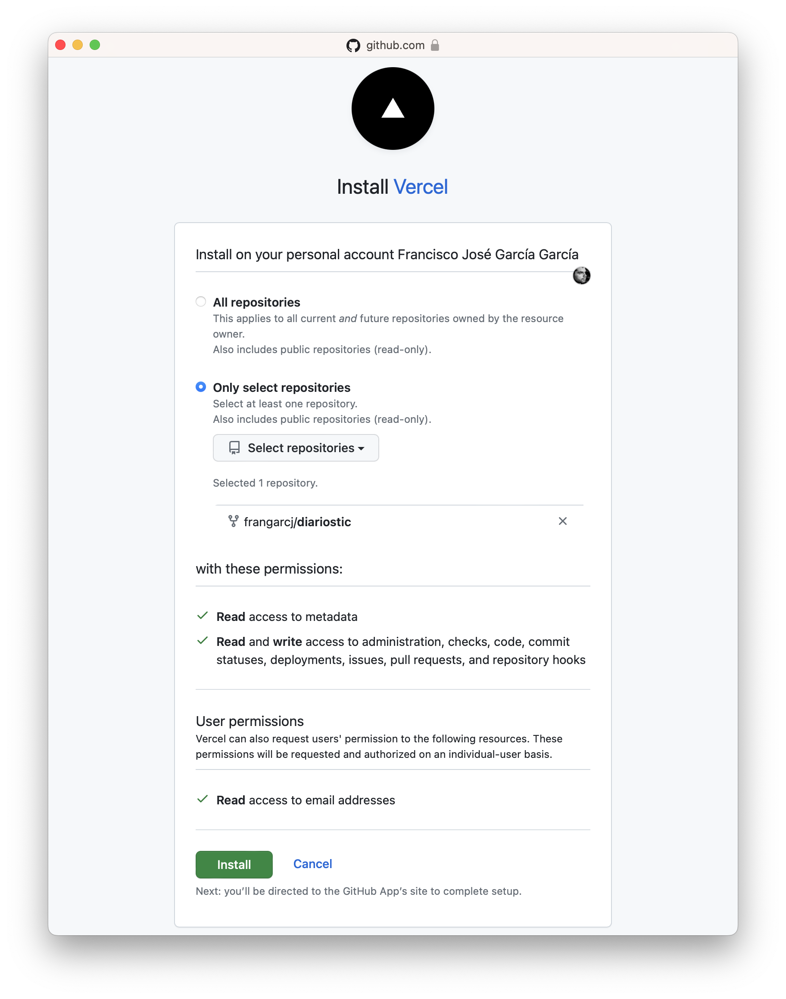
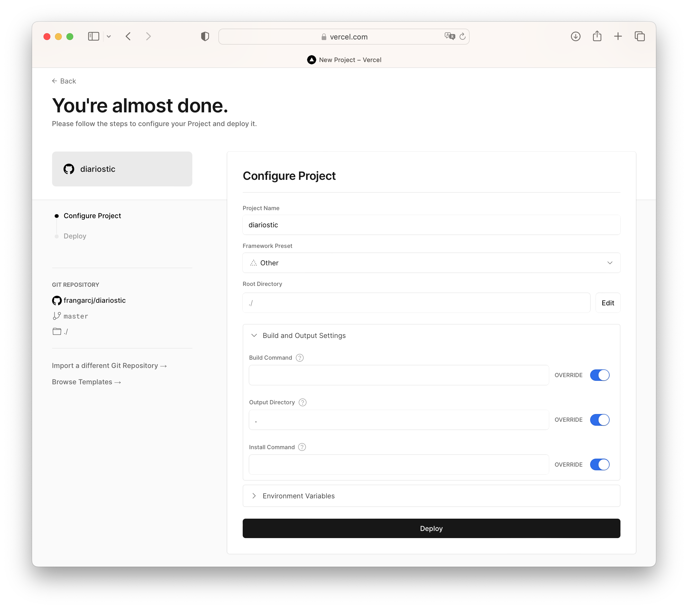
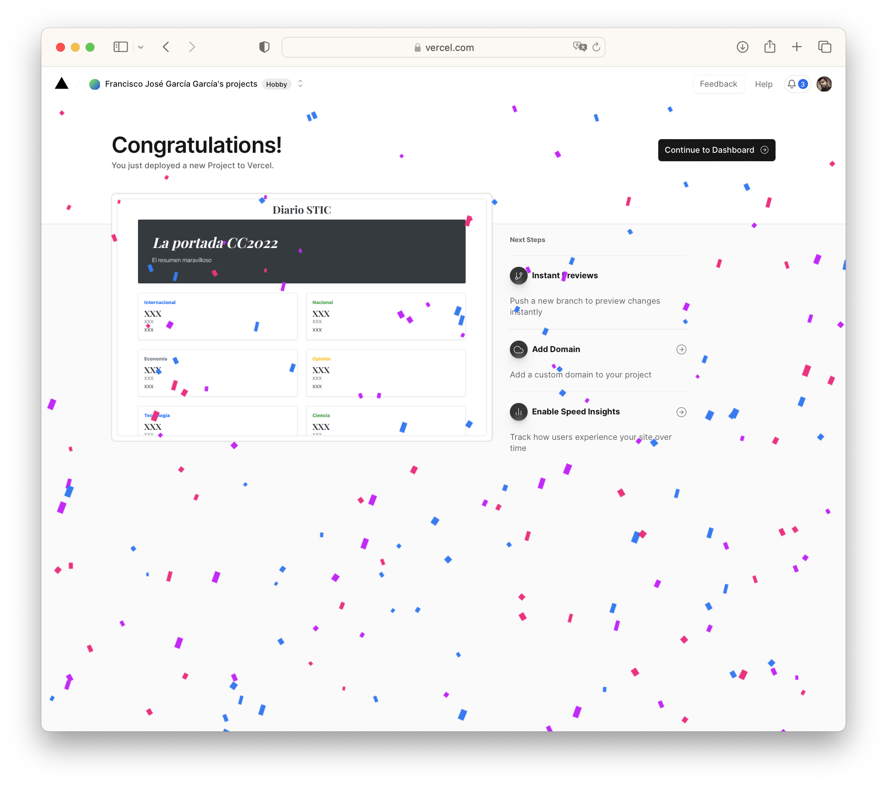
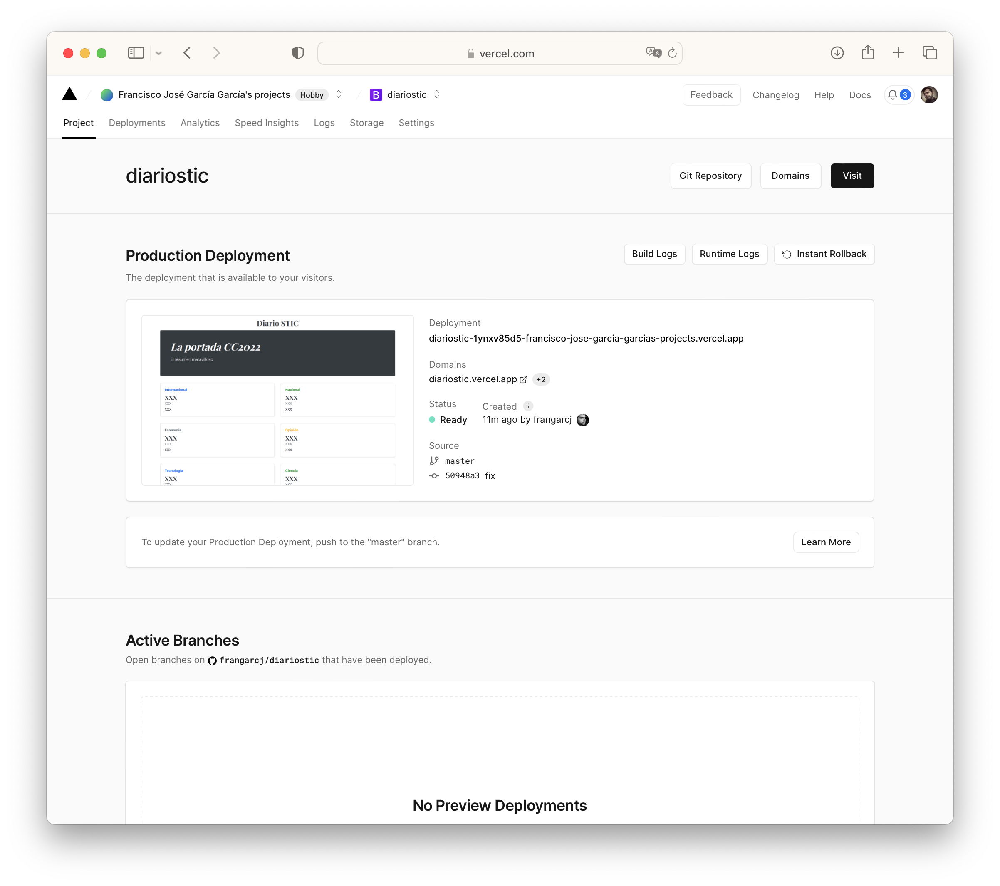
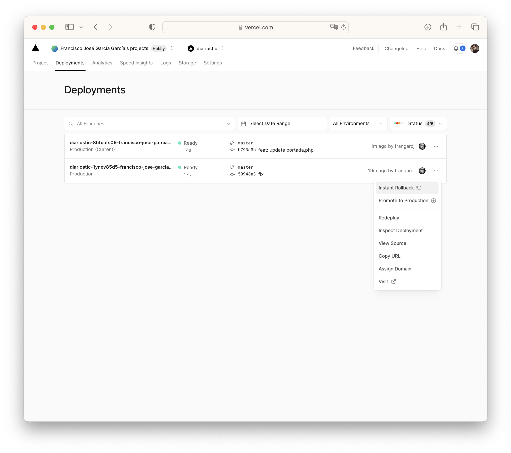

////
NO CAMBIAR!!
Codificación, idioma, tabla de contenidos, tipo de documento
////
:encoding: utf-8
:lang: es
:toc: right
:toc-title: Tabla de contenidos
:doctype: book
:linkattrs:

:figure-caption: Fig.

////
Nombre y título del trabajo
////
# Platform as a Service. Casos de uso en Vercel y App Engine
Cloud Computing - Máster en Ingeniería Informática
Paco García y Manuel Torres <Paco.Garcia@ual.es> <mtorres@ual.es>

image::../Tema0/images/di.png[]

// NO CAMBIAR!! (Entrar en modo no numerado de apartados)
:numbered!: 

[abstract]
== Resumen
El modelo PaaS (Platform as a Service) de cloud computing es un modelo muy cómodo para el desarrollo. En PaaS el proveedor cloud ofrece un entorno o plataforma en el que el equipo de desarrollo puede crear y distribuir aplicaciones sin preocuparse de la infraestructura. El proveedor se encarga del mantenimiento y actualización de la plataforma. Además, ofrece servicios complementarios como bases de datos, monitorización, logging permitiendo centrarse en el desarrollo y despreocupándose de la actualización de versiones del entorno de ejecución, librerías, parches de seguridad y demás.

En este tutorial se realiza una introducción al modo PaaS y se ilustra su funcionamiento desplegando una aplicación sencilla en Vercel y Google App Engine.

////
COLOCA A CONTINUACION LOS OBJETIVOS
////
.Objetivos
* Conocer las ventajas que propociona PaaS.
* Distinguir los modelos IaaS y PaaS.
* Aprender a desplegar aplicaciones en Vercel.
* Utilizar las opciones de despliegue automático y _roll back_ de Vercel.
* Aprender a desplegar aplicaciones en Google App Engine.

// Entrar en modo numerado de apartados
:numbered:

## Introducción

Dentro de los modelos de servicio de cloud computing, en PaaS (Plataform as a Service) el proveedor ofrece un entorno o plataforma en el que los usuarios pueden crear y distribuir aplicaciones sin preocuparse de la infraestructura. Es el proveedor el que proporciona el Sistema operativo, software, librerías, gestión de certificados SSL y demás, todo en su sin preocuparnos de las actualizaciones. Es el proveedor el que se encarga de su mantenimiento. De esta forma, **el modo PaaS permite a los desarrolladores centrarse en el desarrollo. Es ideal para realizar pruebas y crear prototipos de nuevas aplicaciones**

Además los proveedores PaaS suelen ofrecer gran cantidad de servicios que pueden ser consumidos desde las aplicaciones (bases de datos, herramientas de monitorización y logging, almacenamiento, despliegue continuo, y un largo etcétera).

[NOTE]
====
En el modo IaaS (Infraestructure as a Service) el proveedor proporciona almacenamiento, redes, máquinas virtuales y otros servicios virtuales. Es el usuario el encargado del matenenimiento del sistema operativo y todo el software, paquetes y librerías que se instalen sobre él
====

## Vercel

https://vercel.com[Vercel] es un PaaS que permite el despliegue de aplicaciones estáticas (HTML, CSS, JavaScript) y aplicaciones de servidor (Node.js, Go, PHP, Python, Ruby, Java, Docker).

Actualmente Vercel ofrece plaforma para desarrollo en:

* Node.js
* Edge
* Go
* Python
* Ruby
* PHP
* Bash
* Deno
* Rust

### Registro en el plan gratuito de Vercel

Vercel ofrece varios planes comerciales y uno gratuito. El gratuito se llama `Hobby` y es útil para pruebas de concepto y entre otras cosas ofrece despliegue desde GitHub con despliegue continuo y bases de datos PostgreSQL. Por tanto, es una opción muy atractiva para usarlo aquí.

Regístrate con una cuenta de email seleccionando `Sign up` en la esquina superior derecha. Lo primero que debes seleccionar es el tipo de plan. Selecciona `Hobby`, introduce tu numbre y pulsa `Continue`.

A continuación, puedes utilizar una cuenta de GitHub o GitLab para registrarte o una dirección de email. Selecciona la opción que prefieras y completa el registro.

Por último, se te pedirá que confirmes tu número de teléfono. Introduce tu número de teléfono y pulsa `Continue`. Recibirás un SMS con un código que deberás introducir en el campo `Code` y pulsar `Verify`.

## Despliegue en Vercel

A continuación vamos a ver cómo desplegar una aplicación PHP desde un repositorio GitHub activando la opción de despliegue continuo. El despliegue continuo permitirá la actualización de la aplicación de forma desastitida tras una subida de cambios (a una rama) a un repositorio.

### Creación de un fork de la aplicación

Desde tu cuenta de usuario GitHub, crea un fork del https://github.com/ualmtorres/diariostic[repositorio GitHub de la aplicación de ejemplo].

Se trata de una aplicación muy sencilla, con el único fin de servir como prueba de concepto de como el modelo PaaS facilita centrarse en el desarrollo, haciendo transparente al equipo de desarrollo la gestión de la plataforma subyacente (en este caso intérprete PHP, servidor web, librerías, almacenamiento y otros detalles de infraestructura).

+
.El descriptor `vercel.json`
****
La configuración de las aplicaciones de Vercel se realiza mediante un archivo denominado `vercel.json`. En este archivo se especifican, entre otros, el entorno de ejecución, los controladores para atender las peticiones de la aplicación y los archivos estáticos (p.e. imágenes). 

A continuación se muestra un ejemplo de archivo `vercel.json`.

[source, json]
----
{
  "functions": {
    "api/index.php": { <1>
      "runtime": "vercel-php@0.6.0" <2>
    }
  },
  "routes": [
    { "src": "/(.*)",  "dest": "/api/index.php" } <3>
  ]
}
----
<1> Controlador principal para servir la aplicación
<2> Entorno de ejecución
<3> Asociación de rutas a controladores
NOTE]
====
Hay que indicar cómo se gestionan cada una de las rutas de la aplicación en cuanto a código. Esto se realiza mediante elementos en el elemento `functions`. Estos deben de estar en la carpeta `api` de la aplicación.

Más información en la https://vercel.com/docs/projects/project-configuration[documentación oficial].
====
****

image::images/diariostic.png[]

En la pantalla inicial (projects) de Vercel seleccionar `Import Git Repository | Continue with GitHub | Install`. 

Instala Vercel en tu cuenta de GitHub y selecciona el repositorio `diariostic` que acabas de hacer fork.

A continuación, selecciona el repositorio `diariostic` y pulsa `Import`. La siguiente pantalla muestra información sobre la configuración del proyecto. En este caso solo hay que establecer un nombre para la aplicación y pulsar `Deploy`.

[NOTE]
====
El nombre elegido para la aplicación ha de ser único ya que es el que usará para componer el nombre DNS de la aplicación.
====

Tras realizar el despliegue, se mostrará una preview de la aplicación. Pulsar sobre ella para ver la aplicación desplegada.

La opción de despliegue automático esta activa por defecto y permite actualizar la aplicación tras efectuar `push` en la rama indicada del repositorio. En este caso se trata de la rama `master` del repositorio.

### Despliegue automático

Realizar un `push` sobre el repositorio editando directamente el archivo `src/secciones/portada.php` cambiando el título por `Portada actualizada`.

[source, php]
----
<?php

$portada = [
"titulo" => "Portada actualizada", <1>
"autor" => "mtorres",
"resumen" => "Resumen de la portada",
];
?>
----
<1> Cambiar el título

Añade un mensaje al commit (p.e. `Cambio del título de la portada`) y realiza el commit.

Tras unos instantes la aplicación quedará actualizada de forma automática con el nuevo título de la portada.

image::images/diariosticActualizado.png[]

### Roll back

Es posible volver a estados anteriores de la aplicación. Por ejemplo, tras desplegar un cambio comprobamos que la aplicación no funciona correctamente y se necesita volver atrás mientras se resuelve el problema.

La pestaña `Deployments` de la aplicación contiene una lista de toda la actividad llevada a cabo en la aplicación (despliegue de commits, operaciones de build, ...). 

Los despliegues se pueden reconocer porque tienen asociado el hash del commit que tomaron como base. En las opciones de los puntos suspensivos podemos encontrar la opción de `Instant Rollback`. Pulsar sobre el que aparece en el primer commit.

Aparecerá un cuadro de mensaje pidiendo la confirmación para volver a la versión anterior. Pulsar `Continue`.

image::images/VercellRollbackConfirmacion.png[]

Se creará una nueva versión, que aparecerá en el registro de actividad y la aplicación volverá a su estado original tras unos instantes.

image::images/diariostic.png[]

### Otras opciones de interés

En las pestañas de la aplicación se pueden encontrar otras opciones de interés como Analytics, Speed Insights, Logs y sobre todo Storage.

En esta última se pueden crear diferentes bases de datos como KV, Postgres o almacenamiento de ficheros Blob.

[NOTE]
====
Hay que tener en cuenta que el plan gratuito `Hobby` tiene limitaciones en cuanto a número de bases de datos y almacenamiento. Consultar la https://vercel.com/pricing[documentación oficial] para más información.
====

## Despliegue en Google App Engine

Google App Engine es el PaaS de Google. Permite el desarrollo de aplicaciones en una plataforma totalmente gestionada por Google. Actualmente App Engine ofrece plaforma para desarrollo en:

* Node.js
* Ruby
* Java
* C#
* PHP
* Python
* Go

Google App Engine permite el escalado de aplicaciones y distribución por todas las regiones sin tener que preocuparnos de la infraestructura. Se trata de un despligue sin configuración de servidor lo que supone gran agilidad.

. En el Menú de navegación, seleccionar `App Engine`. Aparecerá una pantalla de bienvenida. Pulsar `Crear Aplicación`.

+
image::images/AppEngineBienvenida.png[]

. Indicar la región de despliegue. Elegiremos `europe-west` y pulsaremos sobre `Crear aplicación`.

. Seleccionar el lenguaje en el que está creada la aplicación para que Google App Engine prepare la plataforma de ejecución de la aplicación. En este caso elegiremos PHP.

+
image::images/AppEngineSeleccionarLenguaje.png[]

+
Tras unos instantes se informa que la aplicación se ha creado con éxito. 

+
image::images/AppEngineAppCreada.png[]

+
Se nos ofrecen recursos para la documentación de App Engine en el lenguaje usado y ejemplos de código en GitHub. A la derecha tenemos los comandos que hay que ejecutar en Cloud Shell y que ejecutaremos en unos instantes. Por ahora, saldremos del asistente pulsando `LO HARÉ MAS ADELANTE`.

. Abrir Cloud Shell

. Clonar el repositorio de la aplicación

+
[source, bash]
----
$ git clone https://github.com/ualmtorres/diariostic.git
----

+
. Crear el descriptor `app.yaml` en la carpeta del código de la aplicación

+
[source, bash]
----
$ cd diariostic
$ wget https://gist.githubusercontent.com/ualmtorres/5f4c4f4502c9fc9f84c967a59ec4203e/raw/d6b56d37d72c4f3f15eeecfdab2f84f42551eac4/app.yaml
----

+
.El descriptor `app.yaml`
****
La configuración de las aplicaciones de App Engine se realiza mediante un archivo denominado `app.yaml`. En este archivo se especifican, entre otros, el entorno de ejecución, los controladores para atender las peticiones de la aplicación y los archivos estáticos (p.e. imágenes). 

A continuación se muestra un ejemplo de archivo https://gist.githubusercontent.com/frangarcj/24a93fb35eaa6f6bdcbf6a0769ac36c8/raw/a6444a3408e2eda627b856601dc7b9ad27f292a6/app.yaml[`app.yaml`].

[source, yaml]
----
runtime: php55 <1>
api_version: 1
handlers:
- url: / <2>
  script: api/index.php
# Serve images as static resources.
- url: /(.+\.(gif|png|jpg))$ <3>
  static_files: \1
  upload: .+\.(gif|png|jpg)$
  application_readable: true
# Serve php scripts.
- url: /(.+\.php)$
  script: \1
----
<1> Entorno de ejecución
<2> Controlador principal para servir la aplicación
<3> Controlador para servir archivos estáticos

[NOTE]
====
Hay que indicar cómo se gestionan cada una de las rutas de la aplicación en cuanto a código, imágenes, CSS, JavaScript. Esto se realiza mediante elementos `url` en el elemento `handlers`. 

Más información en la https://cloud.google.com/appengine/docs/standard/python/config/appref?hl=es[documentación oficial].
====
****

+
. Ver la aplicación en modo de prueba

+
[source, bash]
----
$ php -S localhost:8080 -t api
----

+
. Abrir `Vista previa web`

. Inicializar en Cloud Shell el SDK de Google Cloud

+
[source, bash]
----
$ gcloud init
----

+
Para poder usar el SDK de Google Cloud en Cloud Shell, Google Cloud nos advierte que necesita incluir nuestras credenciales en Cloud Shell. Pulsaremos `Autorizar`.

+
image::images/CloudShellAutorizar.png[]

+
. Desplegar la aplicación

+
[source, bash]
----
$ gcloud app deploy
----

+
Nos pedirá confirmación de despliegue sobre el descriptor (`app.yaml`) a usar, el origen (carpeta donde se colocó el repositorio) y el proyecto de destino. Tras confirmar, informará que se ha inicializado el Google Cloud SDK y  comenzará el despliegue. La aplicación quedará almacenada en Google Cloud Storage.

+
[source, bash]
----
descriptor:      [/home/mtorres/diariostic/app.yaml]
source:          [/home/mtorres/diariostic]
target project:  [cloud-computing-mtorres]
target service:  [default]
target version:  [20201101t062114]
target url:      [https://cloud-computing-mtorres.ew.r.appspot.com]

Do you want to continue (Y/n)?
----

+
Unos instantes más tarde podremos ver la aplicación ejecutando `gcloud app browse`. Esto nos proporcionará una URL para acceder a la aplicación si no hay un navegador predeterminado y se obtendrá un resultado como el de la figura.

+
image::images/AppEngineDiarioStic.png[]

La aplicación estará disponible en el `Panel de control` en el el bloque de `App Engine` del Menú de navegación. Mostrará las aplicaciones desplegadas en App Engine con un resumen del tráfico, resumen de las instancias desplegadas, estado de facturación, carga actual, errores y otra información de interés. No se perderán datos, se guardará su estado y posteriormente se podrá volver a habilitar.

image::images/AppEnginePanelDeControl.png[]

[IMPORTANT]
====
Para evitar gastos inncesarios en el cupón de la cuenta de la asignatura, una vez hechas las pruebas inhabilitar la aplicación desde el menú `Configuración` de App Engine.

image::images/AppEngineInhabilitarApp.png[]
====

### Creación de la aplicación en App Engine en modo manual

En lugar de crear la aplicación desde el bloque App Engine del Menú de navegación es posible crear la aplicación directamente desde Cloud Shell con `gcloud init`.

Previamente, se habrá descargado el repositorio de código de la aplicación y se habrá incluido el descriptor de despliegue (`app.yaml`) en el directorio del código de la aplicación.

Para poder usar el SDK de Google Cloud en Cloud Shell, Google Cloud nos advierte que necesita incluir nuestras credenciales en Cloud Shell.

Como no se ha creado proyecto App Engine para la aplicación, nos pedirá si queremos crear proyecto nuevo o meter en existente. El valor introducido de tomará como ID del proyecto y no podrá ser cambiado posteriormente.

Después se desplegará con `gcloud app deploy`. Habrá que indicar una región de despliegue. Seleccionar `europe-west`.

Nos pedirá confirmación de despliegue sobre el descriptor (`app.yaml`) a usar, el origen (carpeta donde se colocó el repositorio) y el proyecto de destino. Tras confirmar, comenzará el despliegue y lo almacenará en Google Cloud Storage.

Para poder construir la aplicación es necesario que el proyecto tengan configurados permisos de acceso a la API de Cloud Build. Se nos pedirá que demos permiso a través de un enlace de activación de Cloud Build API en el proyecto. Se llegará a una pantalla como la siguiente.

image::images/GoogleCloudHabilitarCloudBuildAPI.png[]

Pulsar sobre `Habilitar`. A continuación, pedirá que se indique una cuenta donde vincular la facturación. Indicar la cuenta del cupón de la asignatura.

Una vez configurado el acceso a la API de Cloud Build, volver a Cloud Shell y volver a desplegar con `gcloud app deploy`.

### Despliegue continuo

El despliegue automático en App Engine no es tan directo como en Vercel. Para más información, consultar la https://cloud.google.com/source-repositories/docs/quickstart-triggering-builds-with-source-repositories[documentación oficial].

