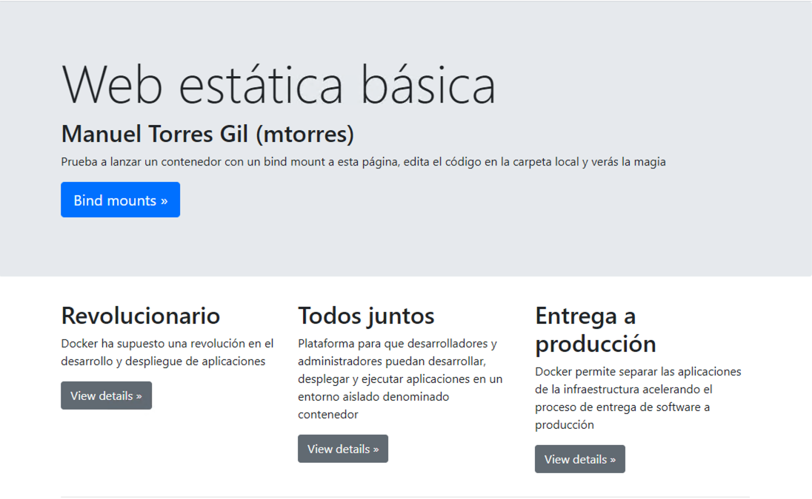
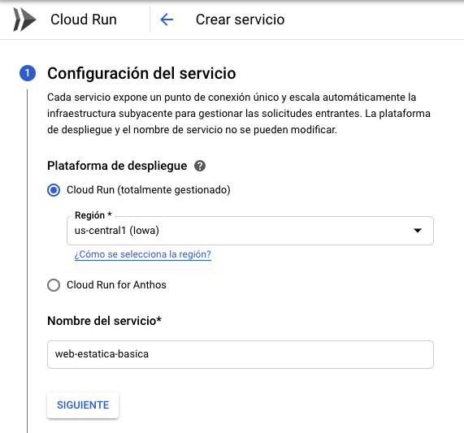
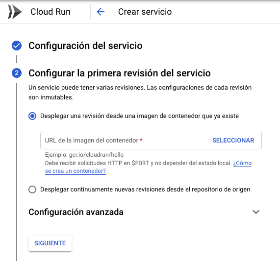
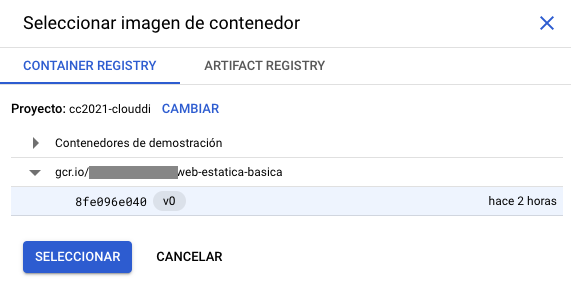
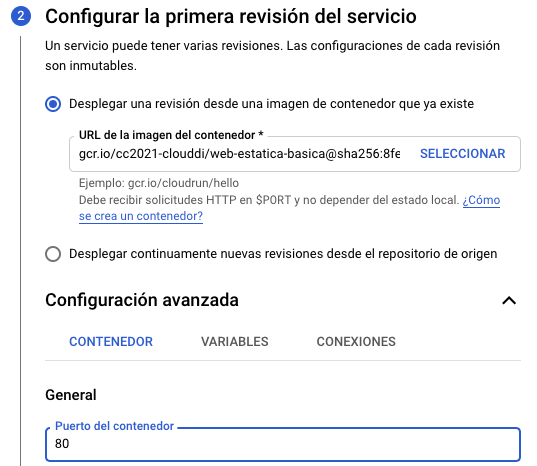
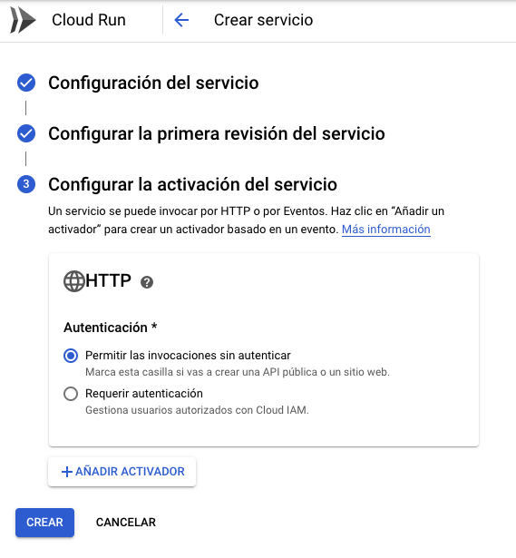
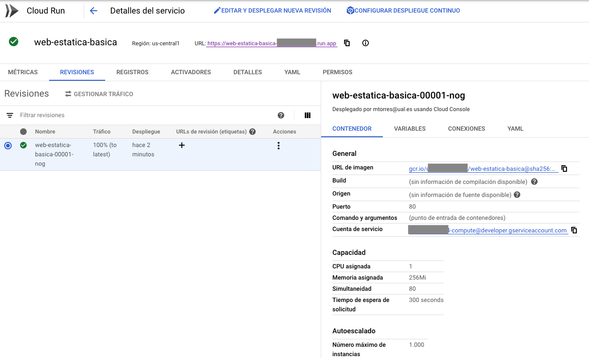

////
NO CAMBIAR!!
Codificación, idioma, tabla de contenidos, tipo de documento
////
:encoding: utf-8
:lang: es
:toc: right
:toc-title: Tabla de contenidos
:doctype: book
:linkattrs:

////
Nombre y título del trabajo
////
# Lab 05 Cloud Computing. Despliegue de contenedores en OpenStack-DI y en Google Cloud
Máster en Tecnologías y Aplicaciones en Ingeniería Informática
José Joaquín Cañadas y Manuel Torres <jjcanada@ual.es> <mtorres@ual.es>

image::../../Docs/Tema0/images/di.png[]

// NO CAMBIAR!! (Entrar en modo no numerado de apartados)
:numbered!: 

[abstract]
== Resumen
////
COLOCA A CONTINUACION EL RESUMEN
////
En este laboratorio se trabaja el despliegue de aplicaciones basadas en contenedores en clouds diferentes. Se practicará creando una imagen de una aplicación y subiéndola a Docker Hub. Posteriormente, se preparará una máquina virtual con Docker en OpenStack y se desplegará la imagen de Docker Hub. Finalmente, se desplegará la misma imagen en una máquina virtual de Google Compute Engine y en Google Cloud Run.

////
COLOCA A CONTINUACION LOS OBJETIVOS
////
.Objetivos
* Crear imágenes propias
* Subir imágenes a un registro de contenedores
* Desplegar contenedores en máquinas virtuales
* Interactuar con el Google Container Registry
* Desplegar contenedores en Cloud Run

.Prerrequisitos
****
* Cuenta creada en Docker Hub.
* Cuenta y proyecto creado en https://openstack.di.ual.es/horizon[OpenStack-DI].
* Cuenta y proyecto creado en Google Cloud.
* Los usuarios de Windows deben tener instalada una herramienta para acceso SSH (p.e. Git Bash, Putty). Los usuarios de Linux y Mac usarán la terminal y no tendrán que instalar nada.
****

// Entrar en modo numerado de apartados
:numbered:

## Recursos

Puedes aprender a usar Docker siguiendo el https://ualmtorres.github.io/usoBasicoDeDocker/[Tutorial Desarrollo de aplicaciones con Docker] o bien en forma de videos donde se dan las explicaciones con mayor detalle:

* Introducción
** https://www.youtube.com/watch?v=rbxa9_y2KrM[Presentación]
** https://www.youtube.com/watch?v=80JvMWs7-IY[Docker vs Máquinas virtuales]
** https://www.youtube.com/watch?v=Ad814U_vN0E[Hello World]
** https://www.youtube.com/watch?v=qiOLNs_9vcA[Crear contenedor]
** https://www.youtube.com/watch?v=WDTeWRHJRiw[Workflow básico]
** https://www.youtube.com/watch?v=o9Izg8c5V5s[Ejemplo de Dockerfile]
** https://www.youtube.com/watch?v=yG5gP8m_Ga0[Comandos básicos]
* Bind mounts
** https://www.youtube.com/watch?v=jHvt3-NKhoA[Introducción a los Bind mounts]
** https://www.youtube.com/watch?v=yK22N8a-vpw[Ejemplo de Bind mount]
** https://www.youtube.com/watch?v=SntpieE3h-Y[Bind mount con MySQL]
* Imágenes
** https://www.youtube.com/watch?v=kIMtlYQ1I1g[Introducción al Dockerfile]
** https://www.youtube.com/watch?v=ypjyt3oHtGo[Desarrollando para hacer el building]
** https://www.youtube.com/watch?v=zIIpQlqfVDo[Creación del Dockerfile]
** https://www.youtube.com/watch?v=PP1vFYSL0ss[Registros remotos]
* Docker Compose
** https://www.youtube.com/watch?v=SQUr5RbgDiM[Introducción a Docker Compose]
** https://www.youtube.com/watch?v=TgSfhA_WmRE[Flujo de trabajo en Docker Compose]
** https://www.youtube.com/watch?v=Y5qEKVIllAI[Importancia de los nombres de los contenedores]
** https://www.youtube.com/watch?v=828AcVmhBdE[Obtener nombre del proyecto]
** https://www.youtube.com/watch?v=_Qds-2X3YHc[Esqueleto de base para aplicación con Docker Compose]
* Desarrollo de una aplicación con Docker Compose
** https://www.youtube.com/watch?v=S6yLbIiAMxA[Desarrollo de la API]
** https://www.youtube.com/watch?v=eDHUY4nMmcc[Construcción de la imagen de la API (1)]
** https://www.youtube.com/watch?v=okw0qv74gkE[Construcción de la imagen de la API (2)]
** https://www.youtube.com/watch?v=e4dApQ5LwHE[Desarrollo de la aplicación (1)]
** https://www.youtube.com/watch?v=k7vMzUmeUhw[Desarrollo de la aplicación (2)]
** https://www.youtube.com/watch?v=j68_ucJOw3E[Construir la imagen de la aplicación]
** https://www.youtube.com/watch?v=stNs5UVc6BU[Despliegue a producción]

## Actividades

### Creación de imagen

. Clonar el https://github.com/ualmtorres/webEstaticaBasica[repositorio] con el proyecto de una web estática básica.
. Modificar el código del `index.html` añadiendo debajo del encabezado 

+
[source, html]
----
<h1 class="display-3">Web estática básica</h1>
----

+
la línea siguiente

+
[source, html]
----
<h2 class="display-6">Nombre Completo (<usuarioUALSin@inlumine.ual.es>)</h2>
----

+
sustituyendo los valores por tu nombre completo y tu usuario UAL sin `@inlumine.ual.es`.
. Modificar el `Dockerfile` para que:
    .. Tome como base una imagen de Apache (https://hub.docker.com/_/httpd[httpd])
    .. Añada el código de la aplicación al directorio donde Apache sirve su contenido (`/usr/local/apache2/htdocs/`)
    .. Cambie el punto de montaje del volumen a `/usr/local/apache2/htdocs/`
. Crear una imagen Docker con el tag `<usuarioDockerHub>/web-estatica-basica:v0` (cambiando el usuario de Docker Hub por el valor correspondiente).
. Subir la imagen a Docker Hub

### Creación de una máquina virtual en OpenStack-DI con un contenedor desplegado

. Lanzar una instancia (máquina virtual) seleccionando una imagen disponible de **Ubuntu 22.04.3 LTS (Jammy Jellyfish)**.

+
[IMPORTANT]
====
En el paso del Asistente de OpenStack para la creación de una nueva instancia especificar que **No cree un nuevo volumen para la nueva instancia**.
====

+
. Configurar el grupo de seguridad default y añadir las reglas del puerto `SSH` (22) para que se pueda acceder a ella por SSH y `HTTP` (80) para que se pueda acceder a ella por el puerto 80.
. Seleccionar el _Sabor_ (Tamaño) de la instancia: `small` (1 vCPU, 2 GB RAM y 20 GB de disco).
. En `Configuración`, añadir en `Customization Script` el https://gist.githubusercontent.com/ualmtorres/dec19ebed2981459f8e5677979eb04c3/raw/21a2613cff7fc4eb11b96e2d373413affc87d8ef/docker.sh[script de instalación de Docker y Docker Compose].
. Asignar una IP flotante a la instancia creada.
. Acceder a la instancia creada mediante una terminal indicando su IP flotante.
. Editar el archivo `/home/ubuntu/.ssh/authorized_keys` y añadir la clave pública del profesor, disponible en el foro general de la asignatura en Aula virtual.
. Ejecutar un contenedor en modo _dettached_ con `docker run` a partir de la imagen de Docker Hub del ejercicio anterior haciendo que el contenedor se muestre en el puerto 80.
. Adjuntar en la actividad disponible en Aula Virtual la dirección IP flotante de la instancia creada.

Al acceder a la instancia desde un navegador debe mostrarse la web que está ejecutando el contenedor y mostrar un resultado similar al de esta figura.

### Creación de una máquina virtual en Google Cloud con un contenedor desplegado

Google Cloud Compute Engine permite la creación de una instancia inicializada con una imagen Docker. Sigue los pasos siguientes:

. Crear en Google Cloud Compute Engine una nueva instancia de máquina virtual con las características siguientes:
.. Nombre: `web-estatica-basica`
.. Configuración de máquina
... Serie: `N1`
... Tipo de máquina: `g1-small` (1 vCPU y 1.7 GB de RAM)
. Activar la casilla de verificación `Desplegar una imagen de contenedor en esta instancia de VM`
. En `Imagen del contenedor` introducir el nombre completo de la imagen subida a Docker Hub en el ejercicio anterior (p.e. `ualmtorres/web-estatica-basica:v0`)

+
[NOTE]
====
Al activar el despliegue de una imagen de contenedor en la instancia, la imagen del disco de arranque pasa a ser una imagen optimizada para contenedores.
====

+
. Activar la casilla de verificación `Permitir el tráfico HTTP`
. Crear la instancia.
. Adjuntar en la actividad disponible en Aula Virtual la dirección IP de la instancia creada.

Transcurridos unos instantes, la instancia será creada y se desplegará la imagen seleccionada. Google Cloud le asignará una IP externa. Al pulsarla se mostrará la web desplegada en el contenedor con la personalización de nuestro nombre y usuario en la UAL.

### Desplegar un contenedor en Google Cloud Run

Google Cloud Run es una plataforma gestionada para el despliegue y escalado de aplicaciones basadas en contenedores. Cloud Run aumenta o disminuye la infraestructura de forma elástica en función del tráfico en un modelo de pago por uso. 

.Subida de una imagen Docker a Google Container Registry
****
Google Cloud proporciona un registro de imágenes privado para cada proyecto. Cloud Run despliega imágenes que estén almacenadas en el registro de imágenes de un proyecto. Para ello, las imágenes deben estar etiquetadas de esta forma

    gcr.io/<proyecto>/<imagen>:<etiqueta>

Cloud Shell incorpora el CLI de Docker. Entonces, usaremos Cloud Shell para subir la imagen que tenemos en Docker Hub. Previamente habrá que descargarla a Cloud Shell. Seguir estos pasos:

. Activar Cloud Shell (Habrá que autorizar a Cloud Shell para que pueda hacer llamadas a la API de Google Cloud).
. Descargar en Cloud Shell la imagen subida a Docker Hub en el primer ejercicio (p.e. `docker pull ualmtorres/web-estatica-basica:v0`)
. Etiquetar en Cloud Shell la imagen descargada de acuerdo con el criterio de Google Cloud Container Registry siguiendo esta sintaxis `docker tag <imagen> <etiqueta-google-cloud-container-registry>`. Por ejemplo:

+
    docker tag ualmtorres/web-estatica-basica:v0 gcr.io/<proyecto>/web-estatica-basica:v0
    
+ 
. Configurar el CLI de Docker para que use la herramienta de línea de comandos de `gcloud` a fin de autenticar las solicitudes a Container Registry. Esto permite que podamos usar el CLI de Docker asociado a Container Registry.

+
    gcloud auth configure-docker

. Subir la imagen al registro privado del proyecto con el id del proyecto adecuado

+
    docker push gcr.io/<proyecto>/web-estatica-basica:v0

Una vez que la imagen ya está en el proyecto podrá ser usada desde diferentes productos de Google Cloud. En este caso usaremos Cloud Run.
****

Sigue los pasos siguientes:

. Seleccionar Cloud Run en la sección Compute del menú de navegación.
. En la barra de herramientas superior selecciona `Crear servicio`.
. Dejar Cloud Run` como plataforma de despliegue, elegir una región e introducir un nombre de servicio (p.e. `web-estatica-basica`)

+

+
. Pulsar `Seleccionar` para seleccionar la imagen subida al Container Registry. 

+

+
Aparecerá un cuadro de diálogo para que indiquemos la versión exacta de la imagen que queremos desplegar. Container Registry mantiene un control de versiones sobre las imágenes. Seleccionar la versión deseada.

+

+
. Desplegar Configuración avanzada e introducir el puerto del contenedor al que se envían las peticiones

+

+
Revisar los valores de capacidad de memoria, CPU, tiempos de espera y peticiones por contenedor. Estos valores son lo que se usarán para aumentar o reducir el número de instancias del contenedor en función de su carga. Prestar atención al número de 
instancias para el autoescalado.

+
. Ir al paso siguiente
. Configurar las peticiones HTTP sin autenticar. Es la opción para webs y APIs públicas.

+

+
. Crear el servicio
. Adjuntar en la actividad disponible en Aula Virtual la URL del servicio creado.

El servicio ha quedado desplegado como un contenedor y está disponible en la URL indicada. Cloud Run muestra información de interés sobre el servicio creado incluyendo URL de la imagen, puertos, capacidad asignada, instancias para el autoescalado, y demás.

También proporciona gráficos con métricas de uso, registro de logs y otras opciones interesantes.

[NOTE]
====
Cada servicio de Cloud Run tiene un punto de conexión único y autoescala los contenedores desplegados. Además, a partir de dos imágenes desplegadas es posible gestionar el tráfico que se dirige a cada uno de los contenedores de cada versión.
====

La figura siguiente ilustra la aplicación desplegada.

## Detener los recursos iniciados

**La instancia creada en Compute Engine y el contenedor desplegado en Cloud Run consumen crédito del cupón de la asignatura mientras estén activos. Haz una parada de los recursos no necesarios para no malgastar el crédito del cupón de la asignatura en Google Cloud. Se trata de detenerlos, no de eliminarlos. En otras actividades los volveremos a iniciar. Mientras tanto, deben quedar detenidos.**
