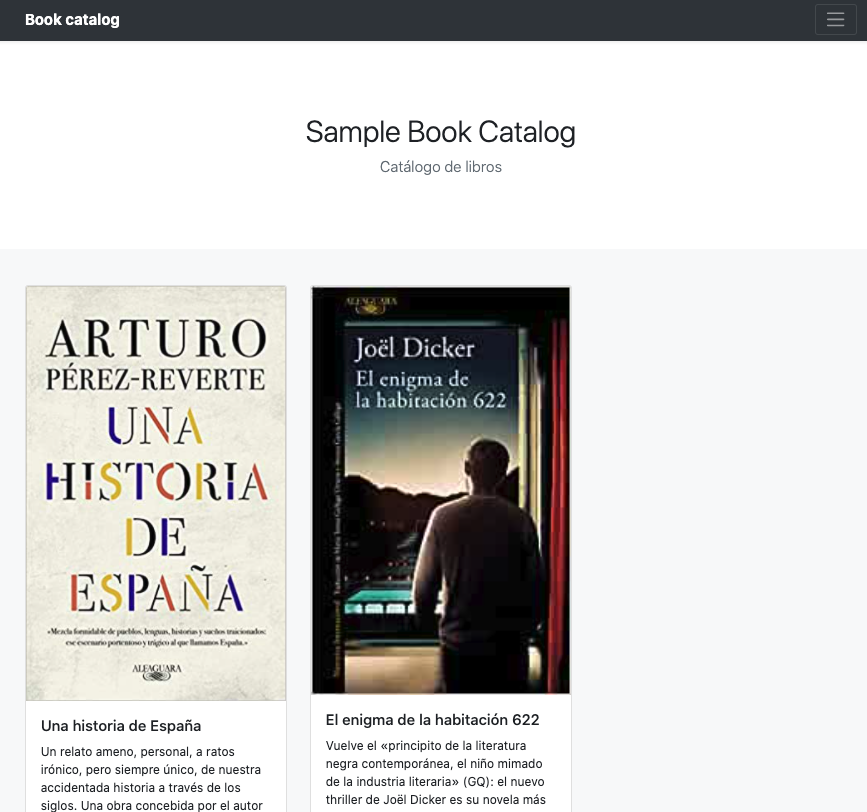
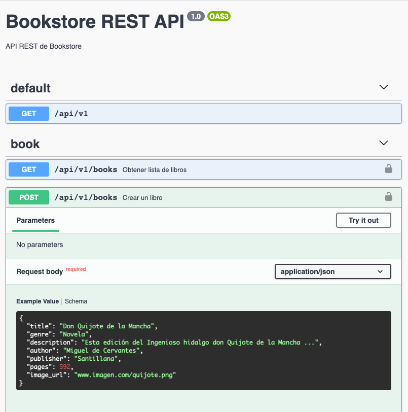
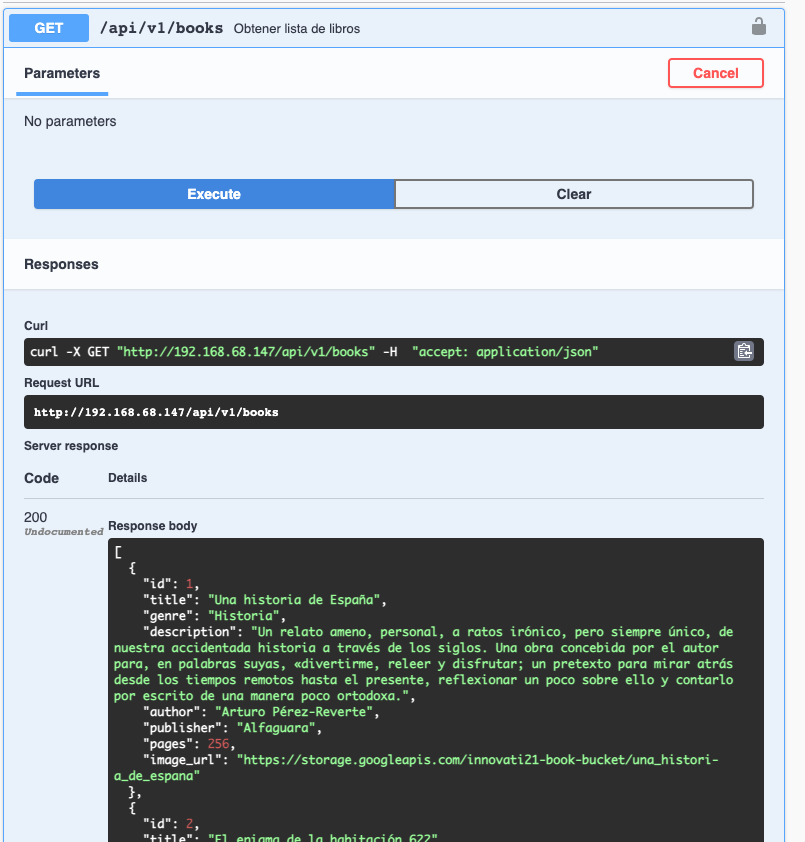

////
NO CAMBIAR!!
Codificación, idioma, tabla de contenidos, tipo de documento
////
:encoding: utf-8
:lang: es
:toc: right
:toc-title: Tabla de contenidos
:doctype: book
:linkattrs:

////
Nombre y título del trabajo
////
# Lab 06 Cloud Computing. Despliegue automatizado con Terraform
Máster en Tecnologías y Aplicaciones en Ingeniería Informática
José Joaquín Cañadas y Manuel Torres <jjcanada@ual.es> <mtorres@ual.es>


image::../../Docs/Tema0/images/di.png[]

// NO CAMBIAR!! (Entrar en modo no numerado de apartados)
:numbered!: 


[abstract]
== Resumen
////
COLOCA A CONTINUACION EL RESUMEN
////
En este laboratorio se trabaja el despliegue de infraestructura con Terraform en clouds diferentes. Se practicará creando infraestuctura en Google Storage. Posteriormente, se preparará una máquina virtual con MySQL en OpenStack y dos máquinas virtuales más con Docker también en OpenStack para el despliegue de una API y una aplicación, respectivamente.
////
COLOCA A CONTINUACION LOS OBJETIVOS
////
.Objetivos
* Trabajar con varios providers Terraform
* Automatizar la creación e inicialización de infraestructura cloud
* Organizar el código Terraform en módulos

.Prerrequisitos
****
* Cuenta y proyecto creado en https://openstack.di.ual.es/horizon[OpenStack-DI].
* Cuenta y proyecto creado en Google Cloud.
****

// Entrar en modo numerado de apartados
:numbered:

## Recursos

Puedes aprender a usar Terraform siguiendo el https://ualmtorres.github.io/SeminarioTerraform//[Tutorial Despliegue de infraestructura cloud con Terraform].

## Actividades

Se trata de realizar el siguiente despligue automatizado con Terraform:

* En Google Storage:
** Crear un bucket inicializado con dos imágenes. Las imágenes serán públicas y se podrá acceder a ellas simplemente con su URL.
* En OpenStack:
** Crear una máquina virtual inicializada con MySQL
** Crear una máquina virtual inicializada con Docker. En la inicialización también se desplegará un contenedor que ofrece una API sobre un catálogo de libros. Ofrece operaciones CRUD y ofrece la documentación en Swagger en `url/docs` para poder interactuar con la API. La API interactúa con la base de datos MySQL anterior.
** Crear una máquina virtual inicializada con Docker. En la inicialización también se desplegará un contenedor que ofrece una aplicación que muestra un catálogo de libros. Recupera los datos de los libros de la API anterior y la imagen de la portada del bucket creado en Google Storage.

La aplicación tiene este aspecto.



[TIP]
====
Se deber tener a mano la clave JSON de Cuenta de servicio del proyecto Google Cloud (https://ualmtorres.github.io/SeminarioTerraform/#truecrear-una-clave-para-la-cuenta-de-servicio[más información]).
====

Tomar como base el código de la carpeta `Mixto` del https://github.com/ualmtorres/terraform-examples[repositorio de ejemplos Terraform] de este laboratorio siguiendo estos pasos para configurar el ejercicio. Contiene:

. Organización de la configuración en dos módulos (`Google-Storage` y `OpenStack`). Los módulos están dentro de una carpeta `modules` para una mejor organización. Cada módulo configura infraestructura en el proveedor cloud correspondiente. Cada módulo contiene:
* Un archivo `providers.tf` (configuración del proveedor cloud).
* Un archivo `variables.tf` (configuración de variables)
* Un archivo `main.tf` (configuración de los recursos del despliegue). 
* El módulo `OpenStack` además tiene el archivo `versions.tf` para adaptar a la versión 0.13 de Terraform.
. Archivo `main.tf` con la llamada a los dos módulos anteriores.
. Archivo `gcp-identity.json` cuyo contenido debe ser reemplazado por la clave JSON de una Cuenta de servicio del proyecto Google Cloud. Mantener el nombre del archivo `gcp-identity.json`.
. Archivo `install_mysql.sh` que instala un servidor MySQL en Ubuntu. El script inicializa una base de datos denominada `SG` de artículos deportivos, configura el acceso desde cualquier dirección IP y configura la clave de `root` a `my_password`.
. Archivo de plantilla `setup-api-docker.tpl` que instala Docker y lanza un contenedor con la API de la aplicación. En la plantilla hay que configurar la ejecución de un contenedor que propociona una API sobre los productos del catálogo de la base de datos.
. Archivo de plantilla `setup-app-docker.tpl` que instala Docker y lanza un contenedor con la aplicación. En la plantilla hay que configurar la ejecución de un contenedor que propociona la aplicación del catálogo de productos interactuando con la API.

### Creación e inicialización del bucket en Google Storage

. Cambiar el contenido del archivo `gcp-identity.json` con el contenido del archivo JSON de clave de la cuenta de servicio del proyecto en Google Cloud.
. En `modules/Google-Storage` modificar:
.. `provider.tf` para configurar Google Cloud como provider
.. `variables.tf` con las variables indicadas
.. `main.tf` siguiendo las instrucciones de los recursos a crear.

[NOTE]
====
Referencia de:

* https://registry.terraform.io/providers/hashicorp/google/latest/docs/resources/storage_bucket[`google_storage_bucket`]
* https://registry.terraform.io/providers/hashicorp/google/latest/docs/resources/storage_bucket_object[`google_storage_bucket_object`]
* https://registry.terraform.io/providers/hashicorp/google/latest/docs/resources/storage_object_access_control[`google_storage_object_access_control`]
====

### Creación e inicialización de las máquinas virtuales en OpenStack

. En `modules/OpenStack` modificar:
.. los arhivos de plantilla siguiendo las instrucciones indicadas en `YOUR CODE HERE`.
.. `provider.tf` para configurar OpenStack como provider
.. `variables.tf` con las variables indicadas
.. `main.tf` siguiendo las instrucciones de los recursos a crear.

[TIP]
====
Se recomienda partir de un proyecto nuevo propio e ir añadiendo paulatinamente fragmentos del código del repositorio de base e ir construyéndolo poco a poco:

* Providers
* Creación del bucket
* Añadir las imágenes al bucket
* Crear la máquina virtual con MySQL
* Crear la máquina virtual con la API
* Crear la máquina virtual con la aplicación
====

.Carga de datos en la base de datos
****
Inicialmente la base de datos está vacía. El contenedor de la API contiene la documentación en Swagger y permite la interacción directa con la base de datos. Para cargar datos, abrir el método POST. Inicialmente muestra esta información sobre la creación de un nuevo libro.



Pulsar el botón `Try out` en la operación `POST`, sustituir los valores del Quijote de la Mancha de ejemplo por este valor JSON modificando el valor del `<bucket-full-name>` en `image_url` por su valor adecuado (p.e. `cc2021-mtorres-book-bucket`)

```
{
  "title": "Una historia de España",
  "genre": "Historia",
  "description": "Un relato ameno, personal, a ratos irónico, pero siempre único, de nuestra accidentada historia a través de los siglos. Una obra concebida por el autor para, en palabras suyas, «divertirme, releer y disfrutar; un pretexto para mirar atrás desde los tiempos remotos hasta el presente, reflexionar un poco sobre ello y contarlo por escrito de una manera poco ortodoxa.",
  "author": "Arturo Pérez-Reverte",
  "publisher": "Alfaguara",
  "pages": 256,
  "image_url": "https://storage.googleapis.com/<bucket-full-name>/una_historia_de_espana"
}
```

Al pulsar `Execute` se enviará la petición a la base de datos y se creará el libro.

Repetir la operación para el libro

```
{
  "title": "El enigma de la habitación 622",
  "genre": "Ficción contemporánea",
  "description": "Vuelve el «principito de la literatura negra contemporánea, el niño mimado de la industria literaria» (GQ): el nuevo thriller de Joël Dicker es su novela más personal. ",
  "author": "Joël Dicker",
  "publisher": "Alfaguara",
  "pages": 624,
  "image_url": "https://storage.googleapis.com/<bucket-full-name>/el_enigma_de_la_habitacion_622"
}
```

Los libros almacenados se pueden recuperar con el endpoint `GET api/v1/books` pulsando sobre `Try out` y a continuación `Execute`. Devolverá algo así:



****