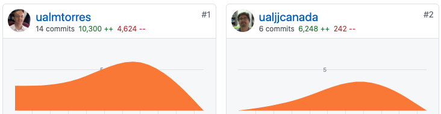

////
NO CAMBIAR!!
Codificación, idioma, tabla de contenidos, tipo de documento
////
:encoding: utf-8
:lang: es
:toc: right
:toc-title: Tabla de contenidos
:doctype: book
:linkattrs:

////
Nombre y título del trabajo
////
# Cloud Computing
Máster en Tecnologías y Aplicaciones en Ingeniería Informática
José Joaquín Cañadas y Manuel Torres <jjcanada@ual.es> <mtorres@ual.es>

image::Docs/Tema0/images/di.png[]

// NO CAMBIAR!! (Entrar en modo no numerado de apartados)
:numbered!: 

[abstract]
== Resumen
////
COLOCA A CONTINUACION EL RESUMEN
////
La asignatura Cloud Computing es una asignatura obligatoria del módulo de Tecnologías informáticas del https://www.ual.es/estudios/masteres/presentacion/7114[Máster oficial en Tecnologías y Aplicaciones en Ingeniería Informática] de la UAL. En la asignatura se hace una introducción al uso de los principales de modelos de Cloud Computing haciendo énfasis en IaaS (_Infrastructure as a Service_) y PaaS (_Platform as a Service_). Se trabajará el desarrollo basado en contenedores Docker para desplegar soluciones escalables en orquestadores de contenedores como Kubernetes.

////
COLOCA A CONTINUACION LOS OBJETIVOS
////
.Objetivos
* Resolución de problemas en entornos nuevos o poco conocidos dentro de contextos más amplios (o multidisciplinares) relacionados con el cloud computing
* Resolver problemas en entornos nuevos o poco conocidos dentro de contextos más amplios y multidisciplinares, siendo capaces de integrar estos conocimientos en entornos de cloud computing
* Que el estudiante sea capaz de resolver problemas
* Modelar, diseñar, definir la arquitectura, implantar, gestionar, operar, administrar y mantener aplicaciones, redes, sistemas, servicios y contenidos informáticos en entornos cloud
* Comprender y aplicar el funcionamiento y organización de Internet, las tecnologías y protocolos de redes de nueva generación, los modelos de componentes, software intermediario y servicios del cloud computing
* Diseñar y evaluar sistemas operativos y servidores, y aplicaciones y sistemas basados en computación distribuida en el cloud computing

// Entrar en modo numerado de apartados
:numbered:

## Introducción

Las aplicaciones comerciales se trasladan a la _Nube_. Esto está ocurriendo más rápido que nunca: el paso de los modelos de software tradicionales a Internet ha adquirido un mayor impulso con el desarrollo del _Cloud Computing_ o Computación en Nube. Se trata de la nueva forma de utilizar las tecnologías de la información y las comunicaciones empleando técnicas ya existentes de una forma innovadora y, sobre todo, a una nueva escala, permitiendo el uso de recursos de hardware, software, almacenamiento, servicios y comunicaciones que se encuentran distribuidos geográficamente y a los que se accede a través de redes públicas, de forma dinámica, cuando se necesita, mientras se necesita y abonando una tarifa sobre lo que se consume.

Los numerosos proveedores de servicios en la nube proporcionan acceso a recursos informáticos y servicios adicionales de valor añadido que acercan la oferta del proveedor a las necesidades de su cliente. Gracias a un grupo creciente de proveedores de servicios en la nube, la computación en la nube es cada vez más importante como mecanismo para que los desarrolladores desplieguen fácilmente sus aplicaciones.

## Sobre la Guía docente

### Materia con la que se relaciona en el Plan de estudios:

La asignatura Cloud Computing está directamente relacionada con las asignaturas siguientes:

* Especialidad Big Data
** Infraestructura Big Data (2Q)
* Módulo de Desarrollo Web Móvil
** Computación en la Nube. Servicios y Aplicaciones (2Q)

Además, la asignatura Cloud Computing proporciona las bases para las asignaturas siguientes:

* Obligatorias
** Integración de Tecnologías y Servicios Informáticos (1Q)
** Planificación de las TIC (1Q)
** Seguridad Informática (1Q)
** Desarrollo web/móvil (1Q)

* Especialidad Big Data
** Análisis de grandes volúmenes de datos (2Q)
** Bases de datos a gran escala (2Q)
** Computación sobre datos masivos (2Q)
* Especialidad IoT
** Infraestructuras en IoT (2Q)
** Aplicaciones de IoT (2Q)
* Módulo de Desarrollo Web Móvil
** Tecnologías y Recursos Web/Móvil (2Q)
** Desarrollo de Aplicaciones Híbridas (2Q)
** Desarrollo Web Basado en Servicios y Componentes (2Q)
** Programación Nativa en Dispositivos Móviles (2Q)

### Conocimientos recomendables

* Linux
* Git
* Desarrollo web

## Contenidos

* Bloque 1 . Modelos de cloud computing
** Tema 1. Modelos de servicio con Computación en la Nube
* Bloque 2 . Servicios y plataformas cloud
** Tema 2. Infraestructura de cloud computing 
** Tema 3. Plataformas como Servicio
** Tema 4. Servicios de Contenedores
* Bloque 3 . Desarrollo y despliegue de aplicaciones y servicios de cloud computing
** Tema 5. Arquitecturas de aplicaciones cloud
** Tema 6. Despliegue de aplicaciones en la nube 
** Tema 7. Servicios Avanzados de Cloud Computing

link:Docs/PlanificacionCC.html[Planificación de la asignatura]

## Horario de clase y de tutorías

* Clases: Aula 4 - CITE III
* Sesiones presenciales (link:Docs/PlanificacionCC.html[Planificación de la asignatura])
** 20 y 27 de octubre de 16h a 18h
** 3, 10, 17 y 24 de noviembre de 16h a 18h
** 1 y 15 de diciembre de 16h a 18h
** 8 sesiones presenciales = 16 horas.
** 7 sesiones no presenciales = 14 horas
* Profesor: Manuel Torres Gil
** Tutorías: Lunes y Miércoles de 11h a 14h (cita previa y a través de Google Meet)
** Despacho: 2.19.5 CITE III (2a planta)
** email: mailto:mtorres@ual.es[mtorres@ual.es]
** Twitter: https://twitter.com/ualmtorres[@ualmtorres]
	
## Cómo seguir la asignatura

* Material disponible en
** https://aulavirtual.ual.es/webapps/blackboard/execute/launcher?type=Course&id=_22698_1&url=[Aula Virtual]
** https://ualmtorres.github.io/AsignaturaCloudComputing/[Repositorio GitHub]

* Metodología docente
** Clases participativas
** Contenido práctico
** Elaboración de trabajos prácticos
** Actividades no presenciales: https://www.coursera.org/programs/ace-track-907-s-3pm27[ Google Associate Engineer Track]
** Tutorías

## Cómo superar la asignatura

* Cada tema tiene una o varias actividades teórico/prácticas, que podrán ser tanto individuales como en equipo.
* Calificación final:
** Pruebas orales/escritas: 40%
** Ejercicios y proyectos presentados en [line-through]#aula virtual# servicios cloud: 50% 
** Asistencia y participación activa en clase: 10%
* Para aprobar la asignatura es obligatorio haber presentado y superado:
** el examen
** los ejercicios y proyectos prácticos

.Criterios e Instrumentos de evaluación
****
* Los ejercicios y proyectos prácticos deberán ser presentados en la fecha indicada utilizando el Aula Virtual y/o las herramientas y servicios cloud, como repositorios de código, proveedores cloud, servicios en la nube, etc., donde quedan registradas la acciones realizadas.
* También se hará seguimiento del gasto de cada estudiante en los servicios Cloud penalizando un uso ineficiente del cupón de gasto disponible.
* En las actividades en equipo, se tendrá en cuenta tanto el trabajo del equipo en su conjunto, como la aportación individual realizada por cada miembro del equipo.

.Ejemplo de gráfico de contribuciones

****

## Encuesta inicial

Si eres alumno de la asignatura en la UAL completa esta https://forms.gle/bPdTzKQFUxmYh2M8A[pequeña encuesta] que permita valorar tus conocimientos iniciales y adaptar el desarrollo de la asignatura.

## Antes de comenzar

* Programa _Associate Cloud Engineer_
** http://ualmtorres.github.io/AsignaturaCloudComputing/Docs/Tema0/PrimerosPasosCoursera.html[Primeros pasos del Associate Cloud Engineer Track ofrecido por Google Cloud]
** https://ualmtorres.github.io/AsignaturaCloudComputing/Docs/Tema0/ResumenProgramaEspecializadoGCE.html[Resumen del Programa Especializado: Architecting with Google Compute Engine]
** https://ualmtorres.github.io/AsignaturaCloudComputing/Docs/Tema0/PlanificacionProgramaGCE.html[Planificación recomendada para seguir el Programa Especializado: Architecting with Google Compute Engine]

* Google Cloud
** http://ualmtorres.github.io/AsignaturaCloudComputing/Docs/Tema0/ActivacionCuentaGoogleCloud.html[Activación de cuenta Google Cloud Platform]
** link:Docs/Tema0/cuenta-facturacion-permisos-profesor.html[Dar permisos al profesor en la cuenta de facturación en GCP]
** link:Docs/Tema0/creacionProyectoGoogleCloud.html[Creación de un proyecto en Google Cloud Platform]
** link:Docs/Tema0/alertas-consumo-GoogleCloud.html[Añadir alertas de consumo (budgets) en Google Cloud]

* Microsoft Azure
** link:Docs/Tema0/Azure/crear-suscripcion-AzureParaEstudiantes.html[Creación de la suscripción Azure para Estudiantes]
** link:Docs/Tema0/Azure/revisar-saldo-AzureParaEstudiantes.html[Revisar el saldo de la suscripción Azure para Estudiantes]
** link:Docs/Tema0/Azure/agregar-administrador.html[Agregar o cambiar los administradores de la suscripción de Azure]
** link:Docs/Tema0/Azure/mover-grupos-recursos-entre-suscripciones.html[Mover los grupos de recursos de una suscripción a otra]
** link:Docs/Tema0/Azure/alertas-consumo-azure.html[Añadir alertas de consumo (budgets) en Azure]

* OpenStack-DI
** https://ualmtorres.github.io/AsignaturaCloudComputing/Docs/Tema0/ActivacionCuentaOpenStackDI.html[Activación de cuenta OpenStack-DI]

## Recursos

### Tema 1. Modelos de servicio con Computación en la Nube

* link:Docs/Tema1/01ModelosDeServicioConComputacionEnLaNube.pdf[Presentación: Modelos de servicio con Computación en la Nube]

### Tema 2. Infraestructura de Cloud Computing

* https://docs.google.com/presentation/d/1Dod2suAnFwq8NSYfWs-ytr4hn2GUEL8yHmtj3yfBP_g/edit?usp=sharing[Presentación: Infraestructura de Cloud Computing]
* link:Docs/Tema2/CreacionBDMySQLGoogleCloud.html[Tutorial: Creación de instancia MySQL en Google Cloud]
* link:Docs/Tema2/AplicacionSGEnModoIaaS.html[Tutorial: Despliegue de una aplicación con base de datos en modo IaaS]

### Tema 3. Plataforma como servicio

* https://docs.google.com/presentation/d/10m4g9zfmX-J90lzsrZbYNimgI-iIzo_HXddLrOjSry0/edit?usp=sharing[Presentación: Plataforma como servicio]
* link:Docs/Tema2/DespliegueAppEngineHeroku.html[Tutorial: Despliegue en Heroku y Google App Engine]

### Tema 4. Servicios de contenedores

* https://docs.google.com/presentation/d/16tMEWtwg9cYlfRBRf-jTFj_bD6ug3cFt8CzuUWpr7QI/edit?usp=sharing[Presentación: Servicios de contenedores]
* https://ualmtorres.github.io/usoBasicoDeDocker/[Tutorial: Desarrollo de aplicaciones con Docker]

### Sesiones de clase

Mientras se formaliza la matrícula definitiva y teneis acceso a Aula virtual, podeis usar estos enlaces provisionales:

* https://eu.bbcollab.com/guest/a7e5426ef2564fde8ed5b31390e7ae81[Sala de videoconferencia]
* https://eu-lti.bbcollab.com/recording/ad2c79adf3764f238329ef6c0f8a836a[Grabación 2020-10-20]
* https://eu-lti.bbcollab.com/recording/0a3403a2c670434882afb505265f5862[Grabación 2020-10-27]
* https://eu-lti.bbcollab.com/recording/a599d2fff1014591865ddf6105ba5098[Grabación 2020-11-03]
* https://eu-lti.bbcollab.com/recording/94afe09c313a495595eca9ebd0366785[Grabación 2020-11-10]

## Trabajo autónomo

* link:Labs/Lab01/index.html[Lab 01. Creación de máquinas virtuales en OpenStack-DI] 
* link:Labs/Lab03/index.html[Lab 03. Despliegue mixto en modo PaaS y en modo IaaS] 

## Actividades no presenciales

https://www.coursera.org/programs/ace-track-907-s-3pm27[Google Associate Engineer Track]

